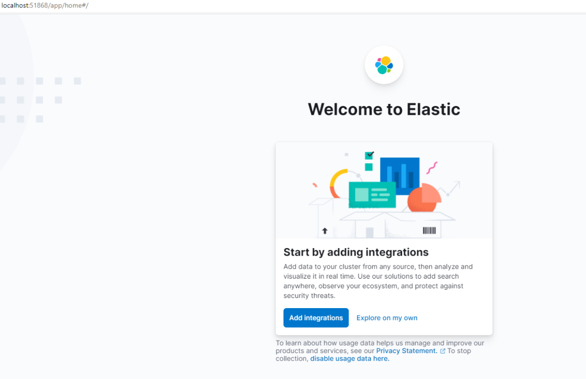
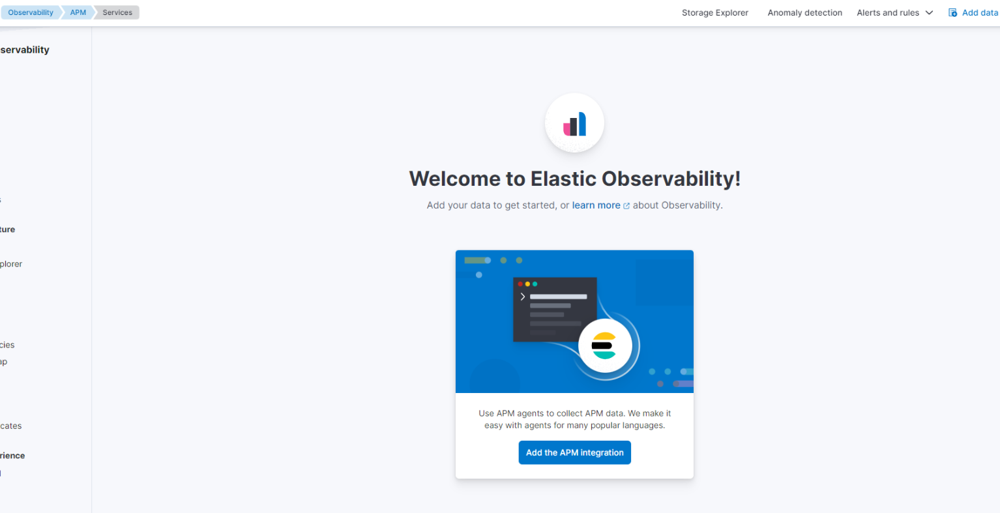
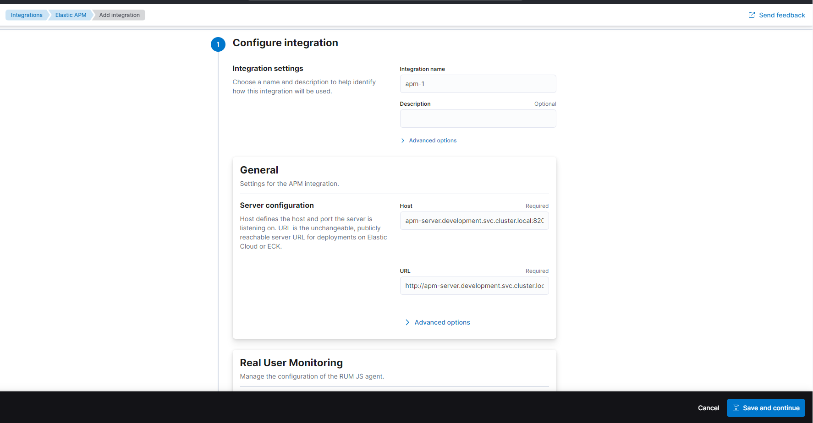
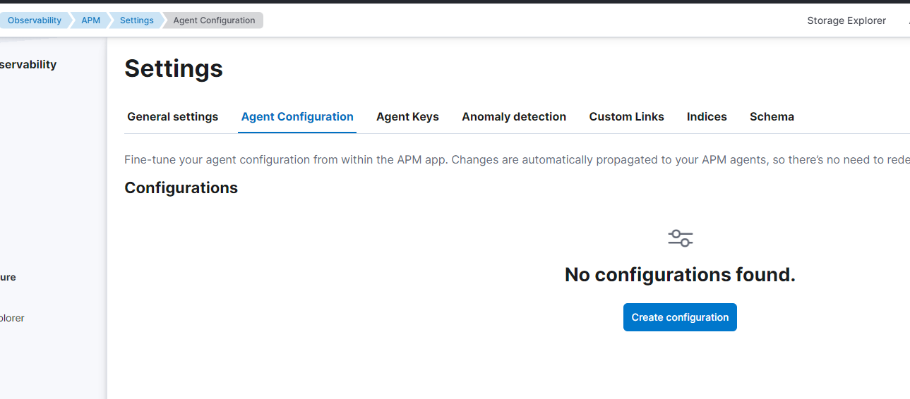
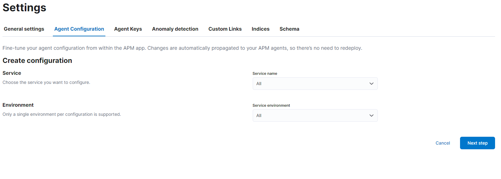
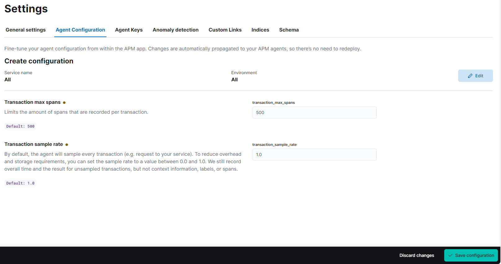
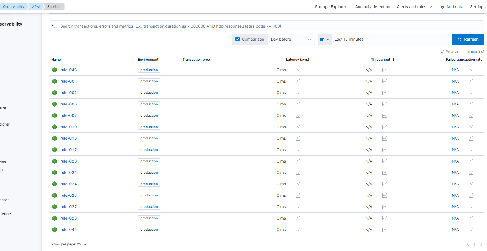

# Setting Up Elastic APM

## **Setting Up Elastic APM**

1. Open your Elastic instance on your browser, which should look like the initial welcome screen you’ve seen.
2. Click on **"Explore on my own"** for a manual setup process.

    

3. Navigate to the **APM** section on your Elastic dashboard and select **"Add APM integration"**.

    

4. In the **Integration name** field, you can input a recognizable name for your APM setup, like "apm-1".
5. Under the **Server configuration** section:

    - For the **Host**, input `apm-server.development.svc.cluster.local:8200`. This is the address and port your APM server listens on.

    - For the **URL**, use `http://apm-server.development.svc.cluster.local:8200`. This URL is the endpoint for the APM server within your cluster.

    

6. Click **"Save and continue"** to proceed to the next steps.
7. Now, move on to **"Create configuration"** for your APM agents:

    - You can leave the **Service** and **Environment** fields as default or select specific ones if necessary.

    - For **Transaction max spans**, the default value is usually set at 500, which determines the number of spans recorded per transaction.

    - The **Transaction sample rate** is set to 1.0 by default, indicating that every transaction will be sampled.

    

8. After setting up these values, click on **"Save configuration"** to finalize the setup.

    
    

9. Your APM agents should now be configured to send performance data to the Elastic APM server.
10. To ensure that the setup is correct, you can create a test transaction and check if it appears in the Elastic APM dashboard.

