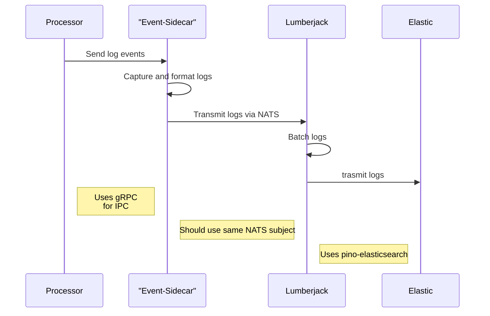

# The Tazama Logging Framework

- [The Tazama Logging Framework](#the-tazama-logging-framework)
   * [Logging](#logging)
      + [Architecture](#architecture)
         - [Sequence Diagram](#sequence-diagram)
         - [Logger](#logger)
         - [Event-Sidecar](#event-sidecar)
            * [Server](#server)
            * [Client](#client)
         - [Lumberjack](#lumberjack)
      + [Implementation](#implementation)
         - [Configuration](#configuration)
            * [With Event-Sidecar and Lumberjack](#with-event-sidecar-and-lumberjack)
               + [Lumberjack](#lumberjack-1)
               + [Event-Sidecar](#event-sidecar-1)
               + [Processor](#processor)
            * [Without Event-Sidecar and Lumberjack](#without-event-sidecar-and-lumberjack)
         - [Usage](#usage)
            * [Logger Service ](#logger-service)
               + [Function Signature:](#function-signature)
            * [Usage:](#usage-1)
            * [Examples:](#examples)
         - [Notes:](#notes)
   * [APM](#apm)
      + [Overview](#overview)
      + [Compatibility](#compatibility)
      + [Setup Instructions](#setup-instructions)
      + [Features and Benefits](#features-and-benefits)
      + [Usage](#usage-2)
         - [Initialization](#initialization)
            * [Configuration Options](#configuration-options)
      + [Example Usage](#example-usage)
      + [Troubleshooting](#troubleshooting)
      + [Additional Resources](#additional-resources)


## Logging
### Architecture

#### Sequence Diagram




At the heart of Tazama's logging stack, there is [pino], a fast json logger which is highly configurable. Tazama also uses the ELK stack for centralised logging of the logs generated by different microservices. There are 3 main components involved in the stack:

- logger
- [lumberjack]
- [event-sidecar]
- [nats]


#### Logger
Tazama uses [pino] as the core logger. Which, at its core is a `json` logger. Pino utilises **transports** [^transport], which describe components that can be used to transmit and transform log output. Pino [recommends](https://github.com/pinojs/pino/blob/main/docs/transports.md#transports) that:

> ... any log transformation or transmission is performed either in a separate thread or a separate process.

Which is where the [event-sidecar] comes in:

#### Event-Sidecar
As per the [pino] recommendation, the [event-sidecar] is a microservice that runs alongside a processor, capturing log events and transmitting them to a set destination [^lumberjack]. 

As the [event-sidecar] is running in a separate process, some inter-process-communication is required in order to transmit the logs from the main processor, to the [event-sidecar]. This is implemented using [gRPC], which involves two pieces. A [client](#client) and a [server](#server).

##### Server
The [event-sidecar] itself, is a [gRPC] server that listens for requests sent by compatible clients following a specific format. The message sent is defined in a protobuf [format][wire]. An extract:

```proto
enum LogLevel {
  trace = 0;
  // omitted
  fatal = 5;
}
message LogMessage {
  string message = 1; // A message for the log
  LogLevel level = 2; // Log level
  // omitted
}

service Lumberjack {
  // Take a LogMessage object and an empty message
  rpc SendLog (LogMessage) returns (google.protobuf.Empty);
}
```

##### Client
Tazama abstracts away the need to write your own [gRPC] client. Simply initialising a logger and providing it with an address will create a [gRPC] client behind the scenes which will send requests to the address that was provided.

An example:

```js
// No sidecar host is provided in the LoggerService constructor
const logger = new LoggerService();
```

An alternative implementation, **opting into** logging with the sidecar (as well as [lumberjack]) may be:
```js
const logger = new LoggerService("192.0.0.1:1234");
```
> [!NOTE]  
> If a sidecar host is provided in the `LoggerService` constructor, you have to ensure your sidecar is live on the address you provided

As [gRPC] is in use, it allows Tazama to be flexible enough to allow logs coming from any client (in any programming language) as long as it adheres to the type that the server expects (defined in the protobuf format above).

After receiving the logs, the [event-sidecar] sends them to [lumberjack] via [NATS]

#### Lumberjack
Lumberjack is a microservice that receives all log events before redirecting them to a central place. This microservice utilises [NATS] to listen for incoming messages with a specific subject. The [event-sidecar] sends messages with a specific subject that [lumberjack] listens for. This microservice depends on [pino-elasticsearch](https://github.com/pinojs/pino-elasticsearch), which is what acts as our transport to transform our logs from our wire format (in the protofile), to the format that [Elastic] search expects.

This microservice has an additional responsibility of batching the received logs before transmission. This has a wide range of benefits as ultimately, I/O operations are reduced which will generally have implications on from improved performance coming from less network calls which can also affect costs in cloud environments.

### Implementation
The [event-sidecar] and [lumberjack] are optional components in implementation. Perhaps hardware is limited or there may be some situations whereby running more microservices is not ideal, Tazama will still have a functional logging implementation if the [event-sidecar] and [lumberjack] are excluded from deployment. As mentioned before, you can opt in to using the [event-sidecar] and [lumberjack] for logging by specifying the sidecar host when initialising the logger service.

#### Configuration

##### With Event-Sidecar and Lumberjack

###### Lumberjack

The following services are required:

- [NATS] - requires a [NATS] server to be running
- [Elastic] - log destination

A sample [.env](https://github.com/frmscoe/lumberjack/blob/ce6cda49bade1a0287bc0c603330e5fbb8159455/.env.example) is provided.

| Variable Name         | Purpose                               | Example             |
|-----------------------|---------------------------------------|---------------------|
| NATS_SERVER           | Specifies the NATS server address      | `nats://localhost:4222` |
| NATS_SUBJECT          | Defines the NATS subject/topic name    | `Lumberjack`        |
| ELASTIC_SEARCH_VERSION| Specifies the Elasticsearch version   | `8.11`              |
| ELASTIC_HOST          | Specifies the Elasticsearch host       | `http://localhost:9200` |
| ELASTIC_USERNAME      | Username for Elasticsearch authentication | `elastic_user`   |
| ELASTIC_PASSWORD      | Password for Elasticsearch authentication | `secretpassword` |
| FLUSHBYTES            | Specifies the number of bytes to flush | `1024`              |


###### Event-Sidecar
A sample [.env](https://github.com/frmscoe/event-sidecar/blob/feb5e53b0801f60fa746e1720349cfb8c09e6c2b/.env.example) is provided.

| Variable Name  | Purpose                              | Example                    |
|----------------|--------------------------------------|----------------------------|
| PORT           | Specifies the port number to use     | `8080`                     |
| NATS_SERVER    | Specifies the NATS server address    | `nats://localhost:4222`    |
| NATS_SUBJECT   | Defines the NATS subject/topic name  | `Lumberjack`               |

> [!CAUTION]
> Ensure the sidecar and lumberjack are pointing to the same instance of [NATS] and have the same subject

###### Processor
In your processor, add the [frms-coe-lib] as a dependency:

```sh
npm i @frmscoe/frms-coe-lib
```

In your processor, create an instance of a `LoggerService` and specify the [event-sidecar] address:

```ts
import { LoggerService } from '@frmscoe/frms-coe-lib';

const logger = new LoggerService("localhost:8080");
```
> [!CAUTION]
> Ensure the sidecar AND [lumberjack] start up before the processor so that logs are not missed.

##### Without Event-Sidecar and Lumberjack
In your processor, add the [frms-coe-lib] as a dependency:

```sh
npm i @frmscoe/frms-coe-lib
```

Configure your environment:
| Variable Name         | Purpose                               | Example             |
|-----------------------|---------------------------------------|---------------------|
| ELASTIC_SEARCH_VERSION| Specifies the Elasticsearch version   | `8.11`              |
| ELASTIC_HOST          | Specifies the Elasticsearch host       | `http://localhost:9200` |
| ELASTIC_USERNAME      | Username for Elasticsearch authentication | `elastic_user`   |
| ELASTIC_PASSWORD      | Password for Elasticsearch authentication | `secretpassword` |

In your processor, create an instance of a `LoggerService`:

```ts
import { LoggerService } from '@frmscoe/frms-coe-lib';

const logger = new LoggerService();
```
#### Usage

You may specify a `LOGSTASH_LEVEL` environment variable in your processor to control your logs. The logging system supports multiple levels of severity, listed in ascending order of importance: `trace`, `debug`, `info`, `warn`, `error`, and `fatal`. When configuring the logging level, every log event with that level or a higher severity will be logged. For example, if you set the logging level to `info`, all log events at `info`, `warn`, `error`, and `fatal` levels will be logged. This ensures that important information and higher severity events are captured while filtering out less critical details.\

After initialising your logger, you may use the methods available to the `LoggerService` instance.

##### Logger Service 


###### Function Signature:

The custom logger function has the following signature for `trace`, `debug`, `log` and `warn` log levels:

```typescript
trace(message: string, serviceOperation?: string, id?: string, callback?: LogCallback): void
debug(message: string, serviceOperation?: string, id?: string, callback?: LogCallback): void
log(message: string, serviceOperation?: string, id?: string, callback?: LogCallback): void
```

- **`message` (required)**: A string that represents the log message to be recorded.

- **`serviceOperation` (optional)**: Specifies the name or identifier of the service operation related to the log message. This parameter provides context about the operation being logged.

- **`id` (optional)**: An optional identifier associated with the log message. Use this parameter to correlate logs related to a specific transaction or request.

- **`callback` (optional)**: A callback function that can be provided to handle asynchronous logging operations or to receive notifications after logging. This parameter is optional and may not be used in all logging scenarios.

Additional Levels:
`error` and `fatal` levels are also supported but they have a custom signature:

```ts
error(message: string | Error, innerError?: unknown, serviceOperation?: string, id?: string, callback?: LogCallback): void;
```

Which allow an instance of an [`Error`](https://developer.mozilla.org/en-US/docs/Web/JavaScript/Reference/Global_Objects/Error) to be sent as an alternative of the usual `string`, for cases where you may want more information contained in the error itself instead of just the error message (`string`)


##### Usage:

- **`trace`**: Used for very detailed or fine-grained informational events. Example: tracing function calls.

- **`debug`**: Used for debugging purposes, providing detailed information for diagnosing issues.

- **`warn`**: Indicates potential issues that should be monitored or investigated.
- **`error`**: Indicates a significant problem that might affect the functionality of the application but does not necessarily cause it to crash immediately.
- **`fatal`**: a critical problem that has caused the application to abort or terminate.

##### Examples:

```typescript
// Example usage of the logger function
logger.log("Processing request...", "Rule901.determineOutcome", "12345");
```

In this example:
- `"Processing request..."` is the log message.
- `"Rule901.determineOutcome"` specifies the service operation context.
- `"12345"` is an optional identifier associated with the log message.

---

#### Notes:

- Ensure to handle log messages appropriately based on their severity and impact on system performance.
- Utilize the optional parameters (`serviceOperation`, `id`, and `callback`) to provide detailed context and functionality as needed.
- Customize the logger implementation to integrate with your specific logging framework or requirements.

For creating a data view in Kibana, a [guide](./Logging-Data-View.md) is provided.

## APM

### Overview
Tazama core processors support integration with Elastic APM for comprehensive Application Performance Monitoring (APM) capabilities which allow for insights into performance metrics.

### Compatibility
Our application is compatible with [Elastic APM] version 8.11.

### Setup Instructions
To integrate with [Elastic APM], follow these steps:
1. Install [Elastic APM] agent in your application environment.
2. Configure the agent with your [Elastic APM] server URL and credentials.
3. Enable instrumentation for your application components.

### Features and Benefits
- Monitor response times, error rates, and other performance metrics.
- Diagnose bottlenecks and optimize application performance.
- Gain visibility into distributed traces and dependencies.

For detailed setup instructions and troubleshooting tips, refer to our [integration guide](./Setting-Up-Elastic-APM.md)

### Usage
In your application, install [frms-coe-lib]:

```sh
npm install @frmscoe/frms-coe-lib
```

#### Initialization
Initialize the APM wrapper (`Apm`) at the earliest point after starting your application. This wrapper simplifies integration with Elastic APM and provides a straightforward interface for monitoring:

```ts
import { Apm } from '@frmscoe/frms-coe-lib/lib/services/apm';

// Initialize Apm
const apm = new Apm({
  serviceName: "myService",
  secretToken: "myToken",
  serverUrl: "http://some-host",
  usePathAsTransactionName: true,
  active: true,
  transactionIgnoreUrls: ['/health'], // Ignore healthcheck path
});

// So we can use this in other files
export default apm;
```

##### Configuration Options
You can configure `Apm` with various options supported by Elastic APM Node.js agent. Refer to the [Elastic APM Node.js documentation](https://www.elastic.co/guide/en/apm/agent/nodejs/current/index.html) for detailed configuration options.

Tazama applications read your environment for [Elastic APM] configuration options.

| Variable           | Purpose                                                                                      | Example                            |
|--------------------|----------------------------------------------------------------------------------------------|------------------------------------|
| `APM_ACTIVE`       | Determines if APM (Application Performance Monitoring) is active for the service.            | `true` (APM is active)             |
| `APM_SERVICE_NAME` | Specifies the name of the monitored service.                                                 | `transaction-monitoring-service`   |
| `APM_URL`          | URL where APM data is sent (This could be an IP address or hostname with port.)              | `http://apm:8200`                  |
| `APM_SECRET_TOKEN` | Token used for authentication and authorization with the APM system.                         | `somesecret`                       |

### Example Usage
Here's an example of how to use `Apm` to monitor a function in your application:

```ts
import './apm';

function importantFunction() {
  // Start a span
   const span = apm.startSpan('calculating sum');
   const sum = 1 + 1;
   span.end();
}
```

### Troubleshooting
If you encounter issues during setup or integration, refer to the [Elastic APM Node.js troubleshooting guide](https://www.elastic.co/guide/en/apm/agent/nodejs/current/troubleshooting.html).

### Additional Resources
For setting up dashboards, consult our [documentation](./Setting-Up-Elastic-APM.md)


[pino]: https://github.com/pinojs/pino
[lumberjack]: https://github.com/frmscoe/lumberjack
[frms-coe-lib]: https://github.com/frmscoe/frms-coe-lib
[wire]: https://github.com/frmscoe/lumberjack
[NATS]: https://nats.io
[gRPC]: https://grpc.io/
[Elastic]: https://www.elastic.co/
[Elastic APM]: https://www.elastic.co/observability/application-performance-monitoring
[elastic-apm-node]: https://www.npmjs.com/package/elastic-apm-node
[event-sidecar]: https://github.com/frmscoe/event-sidecar
[^transport]: [pino-elasticsearch](https://github.com/pinojs/pino-elasticsearch)
[^lumberjack]: [Lumberjack](https://github.com/frmscoe/lumberjack)
