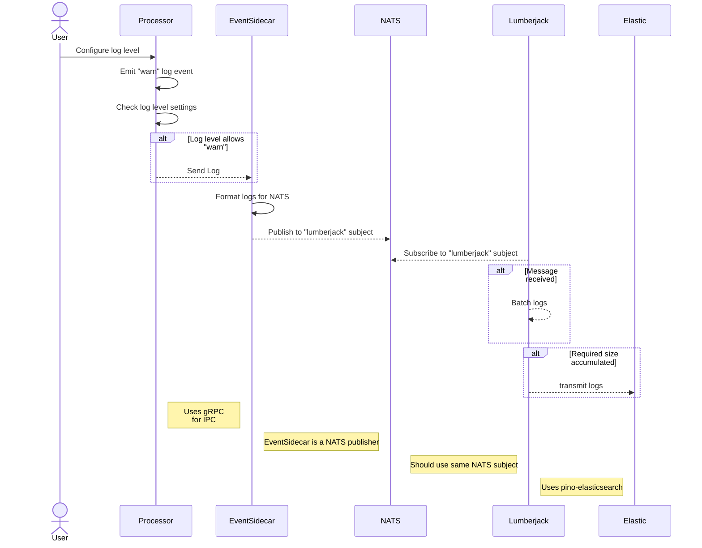

- [Tazama Logging User Guide](#tazama-logging-user-guide)
  - [Prerequisites](#prerequisites)
    - [Dependencies](#dependencies)
  - [Architecture](#architecture)
    - [processor (something to generate logs)](#processor-something-to-generate-logs)
    - [NATS](#nats)
    - [event-sidecar](#event-sidecar)
        - [Server](#server)
        - [Client](#client)
    - [lumberjack](#lumberjack)
  - [Deployment](#deployment)
    - [Prerequisites](#prerequisites-1)
    - [NATS](#nats-1)
    - [ELK (Elastic Logstash Kibana) Stack](#elk-elastic-logstash-kibana-stack)
    - [Event Sidecar](#event-sidecar-1)
      - [Configuration](#configuration)
      - [Running the Event-Sidecar](#running-the-event-sidecar)
    - [Lumberjack](#lumberjack-1)
      - [Configuration](#configuration-1)
        - [FLUSHBYTES](#flushbytes)
          - [Considerations:](#considerations)
          - [Caveats:](#caveats)
          - [Choosing a Value:](#choosing-a-value)
          - [Example Scenario:](#example-scenario)
      - [Running Lumberjack](#running-lumberjack)
    - [Processor](#processor)
      - [Configuration](#configuration-2)
      - [Usage](#usage)
        - [Available Methods](#available-methods)
        - [Calling the logger](#calling-the-logger)
      - [Notes:](#notes)
  - [APM](#apm)
    - [Overview](#overview)
      - [Prerequisites](#prerequisites-2)
    - [Compatibility](#compatibility)
    - [Usage](#usage-1)
      - [Initialisation](#initialisation)
        - [Configuration Options](#configuration-options)
    - [Example Usage](#example-usage)
    - [Troubleshooting](#troubleshooting)
    - [Additional Resources](#additional-resources)

# Tazama Logging User Guide

## Prerequisites

The logging stack depends on some external services to get up and running

### Dependencies

- #### [NATS]
  A [NATS] server is required. Follow the [installation instructions](https://docs.nats.io/running-a-nats-service/introduction/installation) from their website

- #### ELK Stack
  We use the ELK stack for centralised logging and application performance monitoring (APM). You need to have the following services install **[in this specific order](https://www.elastic.co/guide/en/elastic-stack/8.14/installing-elastic-stack.html#install-order-elastic-stack)**: 
  - [Elasticsearch]:
      - If installing on a cloud environment, [EKS](https://github.com/frmscoe/EKS-helm/tree/751462cae1c21bf90ec34513934697af647bf357/charts/elasticsearch) and [AKS](https://github.com/frmscoe/AKS-helm/tree/d95ca3002c9d47cbe7ce23c129c80b71ef932c36/charts/elasticsearch) helm charts are available. If installing on a local environment, it is recommended to follow [upstream documentation](https://www.elastic.co/guide/en/elasticsearch/reference/8.14/install-elasticsearch.html) on installation. A [docker guide](https://www.elastic.co/guide/en/elasticsearch/reference/8.14/docker.html) is also provided
  - [Kibana]:
      - If installing on a cloud environment, [EKS](https://github.com/frmscoe/EKS-helm/tree/751462cae1c21bf90ec34513934697af647bf357/charts/kibana) and [AKS](https://github.com/frmscoe/AKS-helm/tree/d95ca3002c9d47cbe7ce23c129c80b71ef932c36/charts/kibana) helm charts are available. If installing on a local environment, it is recommended to follow [upstream documentation](https://www.elastic.co/guide/en/kibana/8.14/install.html) on installation. A [docker guide](https://www.elastic.co/guide/en/kibana/8.14/docker.html) is also provided

  - [Logstash]:
      - If installing on a cloud environment, [EKS](https://github.com/frmscoe/EKS-helm/tree/751462cae1c21bf90ec34513934697af647bf357/charts/logstash) and [AKS](https://github.com/frmscoe/AKS-helm/tree/d95ca3002c9d47cbe7ce23c129c80b71ef932c36/charts/logstash) helm charts are available. If installing on a local environment, it is recommended to follow [upstream documentation](https://www.elastic.co/guide/en/logstash/8.14/installing-logstash.html) on installation. A [docker guide](https://www.elastic.co/guide/en/logstash/8.14/installing-logstash.html#_docker) is also provided

  - [Apm]:
      - If installing on a cloud environment, [EKS](https://github.com/frmscoe/EKS-helm/tree/751462cae1c21bf90ec34513934697af647bf357/charts/apm) and [AKS](https://github.com/frmscoe/AKS-helm/tree/d95ca3002c9d47cbe7ce23c129c80b71ef932c36/charts/apm) helm charts are available. If installing on a local environment, it is recommended to follow [upstream documentation](https://www.elastic.co/guide/en/observability/current/apm-installing.html) on installation. A [docker guide](https://www.elastic.co/guide/en/observability/current/apm-running-on-docker.html) is also provided

Before proceeding with this documentation, it is recommended that you also familiarise yourself with the following technologies:

- **NATS Messaging System**: This stack utilises [NATS] for message queuing and pub/sub capabilities. Ensure you are familiar with NATS concepts and configuration.
  - [NATS Documentation](https://nats.io)

- **gRPC**: This stack utilises gRPC for communication between services. Understand gRPC concepts such as service definitions, protobuf schemas, and RPC calls.
  - [gRPC Documentation](https://grpc.io/)


Understanding NATS and gRPC functionalities is crucial for effectively implementing and configuring this stack. The documentation provided by NATS and gRPC covers fundamental concepts and advanced configurations that directly impact how logging works. By familiarizing yourself with NATS and gRPC beforehand, you will be better equipped to:

- Configure NATS channels and subscriptions as required by this service.
- Understand how interprocess communication is implemented with gRPC

## Architecture
At the heart of Tazama's logging stack, there is [pino], a fast JSON logger which is highly configurable. There are 4 main components involved in the stack:

### processor (something to generate logs)
  This is the main Node.JS application
### [NATS]
- Used for inter-process communication between the event-sidecar and lumberjack

### [event-sidecar]
- As per the [pino] recommendation, the [event-sidecar] is a microservice that runs alongside a processor, capturing log events and transmitting them to a set destination [^lumberjack]. 

  As the [event-sidecar] is running in a separate process, some inter-process-communication is required in order to transmit the logs from the main processor, to the [event-sidecar]. This is implemented using [gRPC], which involves two pieces. A [client](#client) and a [server](#server).

##### Server
- The [event-sidecar] itself is a [gRPC] server that listens for requests sent by compatible clients following a specific format. The message sent is defined in a protobuf [format][wire]. An extract:

  ```proto
  enum LogLevel {
    trace = 0;
    // omitted
    fatal = 5;
  }
  message LogMessage {
    string message = 1; // A message for the log
    LogLevel level = 2; // Log level
    // omitted
  }

  service Lumberjack {
    // Take a LogMessage object and an empty message
    rpc SendLog (LogMessage) returns (google.protobuf.Empty);
  }
  ```

##### Client
- Tazama abstracts away the need to write your own [gRPC] client. Simply initialising a logger and providing it with an address will create a [gRPC] client behind the scenes which will send requests to the address that was provided.

### [lumberjack]
-  Lumberjack is a microservice that receives all log events before redirecting them to a central place. This microservice utilises [NATS] to listen for incoming messages with a specific subject. The [event-sidecar] sends messages with a specific subject that [lumberjack] listens for. This microservice depends on [pino-elasticsearch](https://github.com/pinojs/pino-elasticsearch), which is what acts as our transport to transform our logs from our wire format (in the protofile), to the format that [Elasticsearch](https://elastic.co) expects. 
  
  
  This microservice has an additional responsibility of batching the received logs before transmission. This has a wide range of benefits as ultimately, I/O operations are reduced which will generally have implications on from improved performance coming from less network calls which can also affect costs in cloud environments.



> A processor will use gRPC to send logs to the [event-sidecar]. The will format the logs and send publish them using NATS. Elsewhere, Lumberjack is subscribed (through NATS), to the same subject. Upon reception, logs are batched and then formatted to conform to Elastic's standard. After all that is done, the logs are finally sent to Elastic.


## Deployment
### Prerequisites
The [event-sidecar] and [lumberjack] use [`frms-coe-lib`](https://github.com/frmscoe/frms-coe-lib). You need to have a personal access token set up to access that library. Refer back to [microprocessor setup instructions](https://github.com/frmscoe/docs/blob/05e5c292dcff908ec06825481cb99de2ecb31b74/Community/Tazama-Contribution-Guide.md#a-preparation) on how to get one.
### NATS
A server can be started with the following command:
```sh
docker run --rm -p 4222:4222 nats
```
> [!NOTE]
> NATS is mapped to port 4222 in the example above. You can read more about [published ports](https://docs.docker.com/network/#published-ports) in the Docker documentation

### ELK (Elastic Logstash Kibana) Stack
Refer back to the [Dependencies - ELK Stack](#elk-stack) section on deploying the ELK stack

### Event Sidecar
Each processor is deployed with its own event-sidecar. A [Dockerfile](https://github.com/frmscoe/event-sidecar/blob/feb5e53b0801f60fa746e1720349cfb8c09e6c2b/Dockerfile) is included in the project.

```sh
git clone https://github.com/frmscoe/event-sidecar.git
cd event-sidecar
docker build . -t event-sidecar
```
#### Configuration
A sample [.env](https://github.com/frmscoe/event-sidecar/blob/feb5e53b0801f60fa746e1720349cfb8c09e6c2b/.env.example) is provided.

| Variable Name | Purpose                             | Example                 |
| ------------- | ----------------------------------- | ----------------------- |
| PORT          | Specifies the port number to use    | `8080`                  |
| NATS_SERVER   | Specifies the NATS server address   | `nats://localhost:4222` |
| NATS_SUBJECT  | Defines the NATS subject/topic name | `lumberjack`            |

> [!NOTE]
> Adapt the ports as needed in your environment. The `PORT` set in the table above does not need to be `8080`.

> [!CAUTION]
> Take note of the `NATS_SERVER` and `NATS_SUBJECT` set in this application's configuration. Lumberjack will need a matching configuration

#### Running the Event-Sidecar
```sh
docker run -p 8080:8080 \
  -e PORT="8080" \
  -e NATS_SERVER="nats:localhost:4222" \
  -e NATS_SUBJECT="lumberjack" \
  event-sidecar
```
Or you can specify an env file:
```sh
docker run -p 8080:8080 --env-file .env event-sidecar
```

### Lumberjack

The following services are required:

- [NATS] - requires a [NATS] server to be running
- [ELK Stack](#elk-elastic-logstash-kibana-stack)

A [Dockerfile](https://github.com/frmscoe/lumberjack/blob/ce6cda49bade1a0287bc0c603330e5fbb8159455/Dockerfile) is included in the project

```sh
git clone https://github.com/frmscoe/lumberjack.git
cd lumberjack
docker build . -t lumberjack
```
#### Configuration
A sample [.env](https://github.com/frmscoe/lumberjack/blob/ce6cda49bade1a0287bc0c603330e5fbb8159455/.env.example) is provided.

| Variable Name          | Purpose                                                                                  | Example                 |
| ---------------------- | ---------------------------------------------------------------------------------------- | ----------------------- |
| NATS_SERVER            | Specifies the NATS server address                                                        | `nats://localhost:4222` |
| NATS_SUBJECT           | Defines the NATS subject/topic name                                                      | `lumberjack`            |
| ELASTIC_SEARCH_VERSION | Specifies the Elasticsearch version                                                      | `8.11`                  |
| ELASTIC_HOST           | Specifies the Elasticsearch host                                                         | `http://localhost:9200` |
| ELASTIC_USERNAME       | Username for Elasticsearch authentication                                                | `elastic_user`          |
| ELASTIC_PASSWORD       | Password for Elasticsearch authentication                                                | `secretpassword`        |
| FLUSHBYTES             | Max size of buffer used to accumulate log messages before they are sent to Elasticsearch | `1024`                  |

> [!CAUTION]
> The `NATS_SERVER` and `NATS_SUBJECT` variables need to match the ones set in the [Event-Sidecar](#configuration) Configuration

##### FLUSHBYTES
Choosing the appropriate value for `FLUSHBYTES` depends on several factors, including your application's logging volume, the expected rate of log messages, and the resources available on your system. Here are some considerations and caveats to keep in mind when deciding on a value:

###### Considerations:

1. **Logging Volume**: Estimate the average size of your log messages and the frequency at which they are generated. A higher logging volume might require a larger `FLUSHBYTES` value to reduce the frequency of Elasticsearch writes and optimize performance (I/O operations). Setting a low [logging level](#usage-and-log-levels), such as trace, will increase the volume of logs generated. 

2. **Memory Usage**: Larger `FLUSHBYTES` values will consume more memory because the buffer needs to hold more log messages before flushing. Ensure your system has enough memory to handle the buffer size comfortably, especially during peak usage.

3. **Network Overhead**: Each flush operation sends log messages to Elasticsearch over the network. Larger `FLUSHBYTES` values mean fewer flush operations but potentially larger payloads, impacting network bandwidth and latency.

4. **Latency vs. Throughput**: A smaller `FLUSHBYTES` value can reduce latency in logging because messages are sent to Elasticsearch more frequently. However, this may come at the cost of throughput if the network or Elasticsearch cluster cannot handle frequent small writes efficiently.

5. **Elasticsearch Cluster Configuration**: Consider the configuration of your Elasticsearch cluster, including its capacity to handle bulk writes and its network throughput capabilities. Adjust `FLUSHBYTES` to align with the cluster's optimal performance characteristics.

###### Caveats:

1. **Memory Constraints**: Setting `FLUSHBYTES` too high can lead to increased memory usage, potentially causing memory pressure on your application or server. Monitor memory usage and adjust accordingly.

2. **Network Bottlenecks**: Setting `FLUSHBYTES` too low might increase network overhead due to frequent flush operations. This can lead to network congestion, especially in environments with limited bandwidth.

3. **Performance Testing**: Conduct performance testing with different `FLUSHBYTES` values to find the optimal balance between latency and throughput for your specific use case.

###### Choosing a Value:

- **Start with Defaults**: If unsure, begin with the default value (1000 is the default from `pino-elasticsearch`) and gradually adjust based on performance metrics and system observations.
  
- **Monitor**: Continuously monitor system metrics such as memory usage, CPU utilization, and Elasticsearch indexing throughput to gauge the impact of `FLUSHBYTES` changes.

- **Benchmark**: Benchmark different values in a staging or development environment to understand how they affect application performance and Elasticsearch indexing speed.

###### Example Scenario:

- **High Volume Logging**: For applications generating a high volume of log messages, consider setting a larger `FLUSHBYTES` value (e.g., several megabytes) to reduce the frequency of Elasticsearch writes and optimize performance.

- **Low Latency Requirements**: If your application requires low latency in logging, consider setting a smaller `FLUSHBYTES` value to ensure log messages are sent to Elasticsearch more frequently, reducing the delay in visibility.


#### Running Lumberjack
```sh
docker run --env-file .env event-sidecar
```
No port mapping is needed for this application as NATS is used for communication.

> [!CAUTION]
> Ensure the sidecar and lumberjack are pointing to the same instance of [NATS] and have the same subject

### Processor
In your processor, add the [frms-coe-lib] as a dependency:

```sh
npm i @frmscoe/frms-coe-lib
```
Then create an instance of a `LoggerService` and specify the [event-sidecar] address (refer back to event-sidecar [configuration](#configuration) and take note of the `PORT` you used):

```ts
import { LoggerService } from '@frmscoe/frms-coe-lib';

const logger = new LoggerService("localhost:8080"); // here, 8080 is the port we used in the example
```
> [!CAUTION]
> Ensure the event-sidecar AND [lumberjack] start up before the processor so that logs are not missed.

#### Configuration
| Variable Name  | Purpose                                             | Example |
| -------------- | --------------------------------------------------- | ------- |
| LOGSTASH_LEVEL | Specifies the minimum log level to capture logs for | `warn`  |


The logging system supports multiple levels of severity. In ascending order of importance:
- **`trace`**: Used for very detailed or fine-grained informational events. Example: tracing function calls.

- **`debug`**: Used for debugging purposes, providing detailed information for diagnosing issues.
- **`log`**: General information that is useful to report on (database write, database read, service starting/stopping)
- **`warn`**: Indicates potential issues that should be monitored or investigated.
- **`error`**: Indicates a significant problem that might affect the functionality of the application but does not necessarily cause it to crash immediately.
- **`fatal`**: a critical problem that has caused the application to abort or terminate.

When configuring the logging level, every log event with that level or a higher severity will be logged. For example, if you set the logging level to `info`, all log events at `info`, `warn`, `error`, and `fatal` levels will be logged. This ensures that important information and higher severity events are captured while filtering out less critical details.

After initialising your logger, you may use the methods available to the `LoggerService` instance.

#### Usage
##### Available Methods
The custom logger function has the following signature for `trace`, `debug`, `log` and `warn` log levels:

```typescript
trace(message: string, serviceOperation?: string, id?: string, callback?: LogCallback): void
debug(message: string, serviceOperation?: string, id?: string, callback?: LogCallback): void
log(message: string, serviceOperation?: string, id?: string, callback?: LogCallback): void
warn(message: string, serviceOperation?: string, id?: string, callback?: LogCallback): void
```

- **`message` (required)**: A string that represents the log message to be recorded.

- **`serviceOperation` (optional)**: Specifies the name or identifier of the service operation related to the log message. This parameter provides context about the operation being logged.

- **`id` (optional)**: An optional identifier associated with the log message. Use this parameter to correlate logs related to a specific transaction or request.

- **`callback` (optional)**: A callback function that can be provided to handle asynchronous logging operations or to receive notifications after logging. This parameter is optional and may not be used in all logging scenarios.

In addition to the :
`error` and `fatal` levels are also supported, but they have a signature that is a bit different from their lower severity counterparts:

```ts
error(message: string | Error, innerError?: unknown, serviceOperation?: string, id?: string, callback?: LogCallback): void;
fatal(message: string | Error, innerError?: unknown, serviceOperation?: string, id?: string, callback?: LogCallback): void;
```

This allows an instance of an [`Error`](https://developer.mozilla.org/en-US/docs/Web/JavaScript/Reference/Global_Objects/Error) to be sent as an alternative of the usual `string`, for cases where you may want more information contained in the error itself instead of just the error message (`string`)

##### Calling the logger

```typescript
// Example usage of the logger function
logger.log("Processing request...", "Rule901.determineOutcome", "12345");
```

In this example:
- `"Processing request..."` is the log message.
- `"Rule901.determineOutcome"` specifies the service operation context.
- `"12345"` is an optional identifier associated with the log message.


#### Notes:

- Ensure to handle log messages appropriately based on their severity and impact on system performance. Remember that lower levels equate to more logs. More log events have an impact on resource usage.
- Utilise the optional parameters (`serviceOperation`, `id`, and `callback`) to provide detailed context and functionality as needed.
- Customise the logger implementation to integrate with your specific logging framework or requirements.

## APM

### Overview
Tazama core processors support integration with Elastic APM for comprehensive Application Performance Monitoring (APM) capabilities which allow for insights into performance metrics.

#### Prerequisites
A running [ELK Stack](#elk-elastic-logstash-kibana-stack) with APM

### Compatibility
Our application is compatible with Elastic [APM] version 8.11.

For detailed setup instructions and troubleshooting tips, refer to our [integration guide](./Setting-Up-Elastic-APM.md)

### Usage
In your application, install [frms-coe-lib]:

```sh
npm install @frmscoe/frms-coe-lib
```

#### Initialisation
Initialise the APM wrapper (`Apm`) at the earliest point after starting your application. This wrapper simplifies integration with Elastic APM and provides a straightforward interface for monitoring:

```ts
import { Apm } from '@frmscoe/frms-coe-lib/lib/services/apm';

// Initialize Apm
const apm = new Apm({
  serviceName: "myService",
  secretToken: "myToken",
  serverUrl: "http://some-host",
  usePathAsTransactionName: true,
  active: true,
  transactionIgnoreUrls: ['/health'], // Ignore healthcheck path
});

// So we can use this in other files
export default apm;
```

##### Configuration Options
You can configure `Apm` with various options supported by Elastic APM Node.js agent. Refer to the [Elastic APM Node.js documentation](https://www.elastic.co/guide/en/apm/agent/nodejs/current/index.html) for detailed configuration options.

Tazama applications read your environment for Elastic [APM] configuration options.

| Variable           | Purpose                                                                           | Example                          |
| ------------------ | --------------------------------------------------------------------------------- | -------------------------------- |
| `APM_ACTIVE`       | Determines if APM (Application Performance Monitoring) is active for the service. | `true` (APM is active)           |
| `APM_SERVICE_NAME` | Specifies the name of the monitored service.                                      | `transaction-monitoring-service` |
| `APM_URL`          | URL where APM data is sent (This could be an IP address or hostname with port.)   | `http://apm:8200`                |
| `APM_SECRET_TOKEN` | Token used for authentication and authorization with the APM system.              | `somesecret`                     |

### Example Usage
Here's an example of how to use `Apm` to monitor a function in your application:

```ts
import './apm';

function importantFunction() {
  // Start a span
   const span = apm.startSpan('calculating sum');
   const sum = 1 + 1;
   span.end();
}
```

### Troubleshooting
If you encounter issues during setup or integration, refer to the [Elastic APM Node.js troubleshooting guide](https://www.elastic.co/guide/en/apm/agent/nodejs/current/troubleshooting.html).

### Additional Resources
For setting up dashboards, consult our [documentation](./Setting-Up-Elastic-APM.md)


[Elasticsearch]: https://www.elastic.co/
[Logstash]: https://www.elastic.co/logstash
[Kibana]: https://www.elastic.co/kibana
[Apm]: https://www.elastic.co/observability/application-performance-monitoring
[NATS]: https://nats.io
[gRPC]: https://grpc.io
[pino]: https://github.com/pinojs/pino
[frms-coe-lib]: https://github.com/frmscoe/frms-coe-lib
[event-sidecar]: https://github.com/frmscoe/event-sidecar
[lumberjack]: https://github.com/frmscoe/lumberjack
[wire]: https://github.com/frmscoe/lumberjack
[^lumberjack]: [Lumberjack](https://github.com/frmscoe/lumberjack)