# What do we log

This document will show what data we log and where to get each type of data is cataloged and displayed.

- [What do we log](#what-do-we-log)
  - [Telemetry](#telemetry)
  - [Metrics](#metrics)
    - [Elasticsearch Metrics](#elasticsearch-metrics)
    - [Linkerd Metrics](#linkerd-metrics)
  - [Container Logs](#container-logs)
    - [Set the level of logging](#set-the-level-of-logging)
    - [How to View Logs](#how-to-view-logs)
    - [How to Add Logs](#how-to-add-logs)

## Telemetry

Telemetry refers to data collected from a remote source and is collected and cataloged by Elasticsearch.
[see the guide](../../Product/01-Getting-Started/01-Developer-Documentation/01-Set-Up-The-Environment/03-Elasticsearch/01-Adding-Custom-Telemetry-To-Apm.md)
Telemetry can be gathered by using the Elasticsearch APM module [see the guide](../../Product/01-Getting-Started/01-Developer-Documentation/01-Set-Up-The-Environment/03-Elasticsearch/01-Adding-Custom-Telemetry-To-Apm.md). Telemetry data is stored inside of the Elasticsearch container volume to ensure that if the pod restarts the data will be secure as can be seen below:

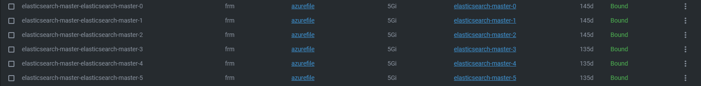

Below follows some examples of what telemetry is collected and stored:

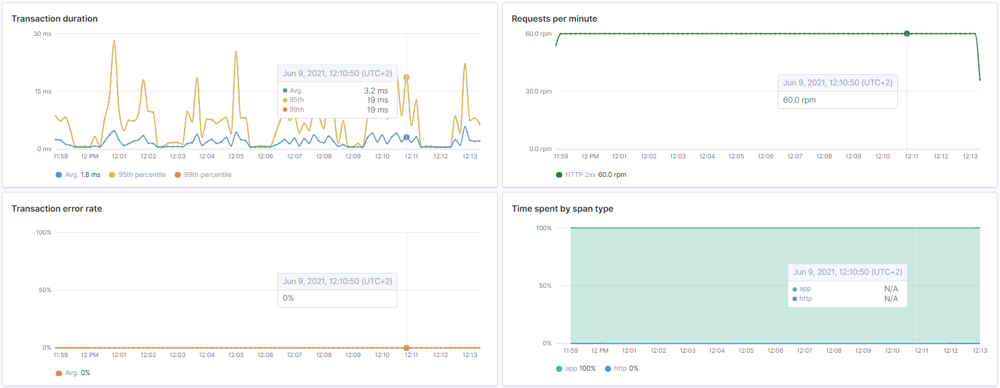

Transaction summary data will include a live graph of the Transaction selected for viewing. This is useful for showing execution time differences based on load.

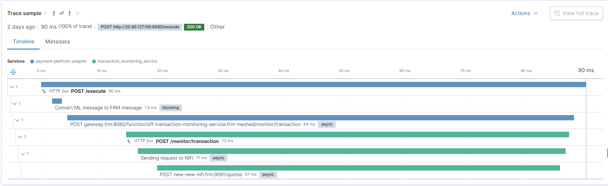

Request Trace will show all the contact points a transaction has with various services. This is useful to show the flow of transactions in the system.

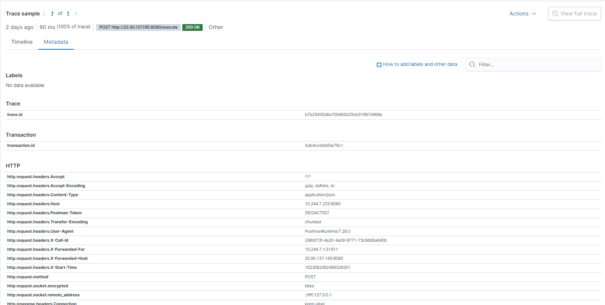

Request Metadata will show all the metadata of the Transaction selected for viewing. Metadata will include valuable data such as where the request came from, which container the request is executing in, IP of the host, IP of the client, IP of the request origin, Trace ID, Transaction ID and various other info.

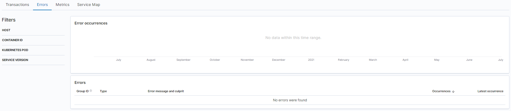

Any Errors that result in an HTTP error code response will also be collected and displayed, however at the time of writing this no HTTP errors have been logged yet.

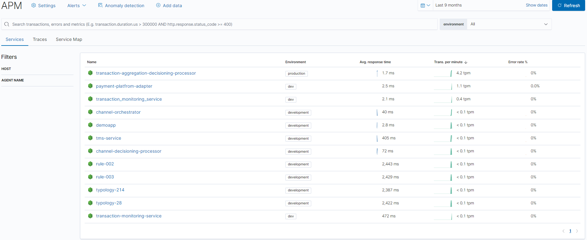

All Telemetry gathered by Elasticsearch can be viewed in a Collective view, thus we can see tpm (transactions per minute), average response time, and the error rate of all the services we currently monitor.

## Metrics

Metrics refers to data gathered referring to the impact that the service has on the system.

Metrics are gathered from two different places and stored accordingly.

### Elasticsearch Metrics

Elasticsearch gathers metrics for each service added to the APM. The metrics can be accessed by looking into the service:

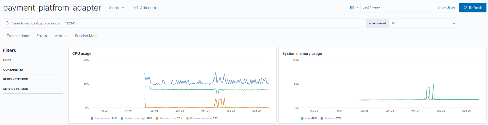

### Linkerd Metrics

By adding the Linkerd sidecar to containers we can also collect container-based metrics from those containers. Here are a few examples of Metrics automatically gathered by Linkerd:

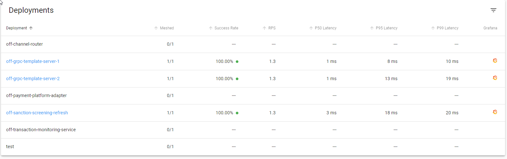

These metrics include all metrics from the meshed deployments, notice how unmeshed services don’t have any metrics connected to them.

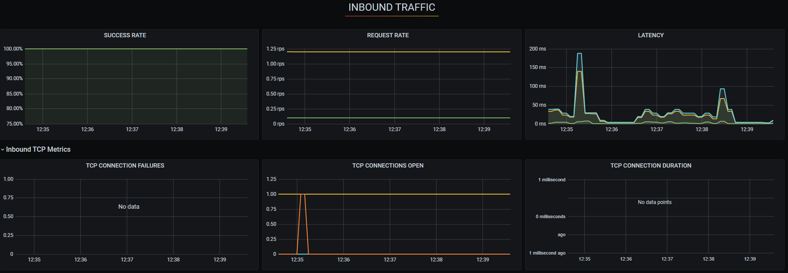

Network metrics collected by Linkerd and visualized automatically through Grafana

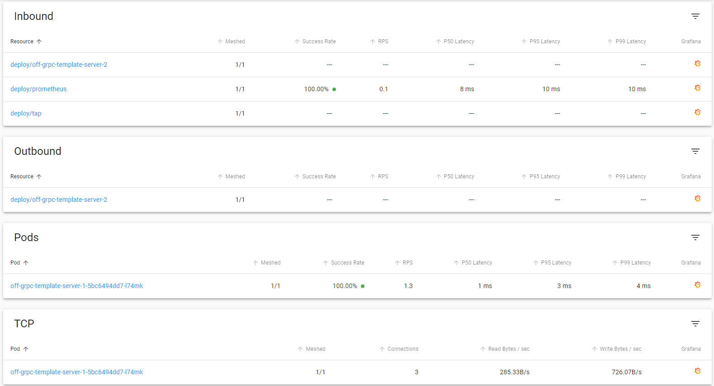

Route Metrics are filtered per service and shows all the Metrics regarding connections to and from the service selected.

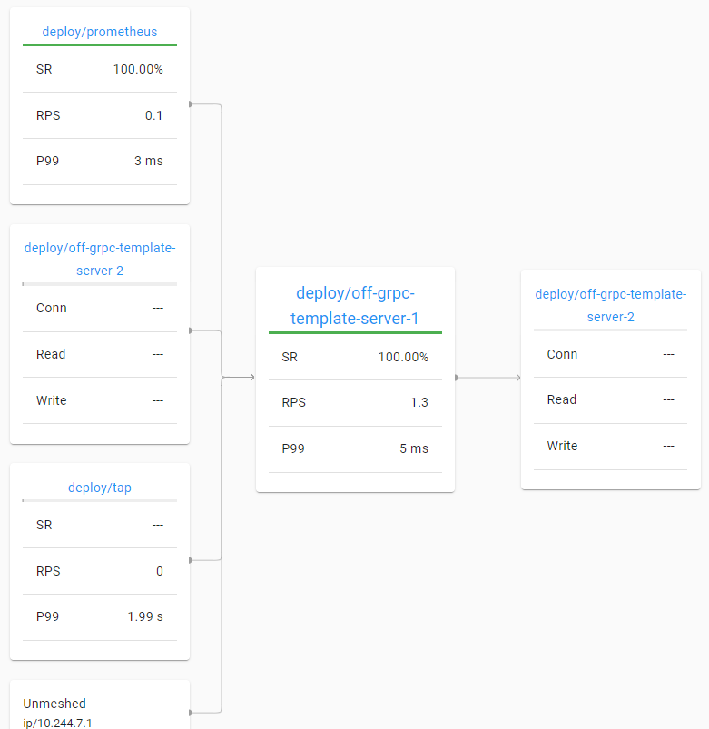

The route metrics from above are shown in a more digestible graph format.


All requests to the container can be “Tapped” live.


Details for each request can also be viewed if needed.

## Container Logs

### Set the level of logging

The level of logging assists with how much logging should be executed or logged, we have different types of logging e.g. warn, error, and info.

These will be statements that will be logged based on the level that is specified, the default value is ‘info’ which includes every logging, the level of the log can be assigned on the docker file for production and on the dot environment file if starting up for development.

Having these levels of logging within these processors improves the readability, in the console logging level or in KIBANA stream logs, as each level has a level of detail it brings. Additionally, the lesser the detail the better the performance which is always a good thing for transactional systems like FRMS.

The environment variable is LOGSTASH\_LEVEL the different levels are outlined as follows and filtering is below.

1. 'info': warn, log, error

2. 'warn’: warn, error

3. ‘error’: error

### How to View Logs

Container logs are stored in Elasticsearch and retrieved via LogStash. Whenever the container runs it will collect all of the logs sent by the code to LogStash, then it is transferred to Elasticsearch where it will be cataloged and stored in the “log*” Index. To see these logs navigate here:


The logs will load in a Quickview:


From here you can expand each entry to see more details:


These logs are highly configurable and will log whatever is given to them.

### How to Add Logs

In order to add your own logs simply follow these steps:

- Install the Logstash package

```bash
npm i @log4js-node/logstash-http
```

- Add the Logstash configuration:

```
log4js.configure({
  appenders: {
    logstash: {
      type: '@log4js-node/logstash-http',
      url: `http://${configuration.logstashHost}:${configuration.logstashPort}/_bulk`, 
      application: 'logstash-log4js', 
      logType: 'application', 
      logChannel: configuration.functionName
    }
  },
  categories: {
    default: { appenders: ['logstash'], level: 'info' }
  }
});
const logger = log4js.getLogger();
logger.info();
logger.warn();
logger.error();
```

Attached in this document is the full logger.ts class for ease of download and use.

[logger.ts](logger.ts)
