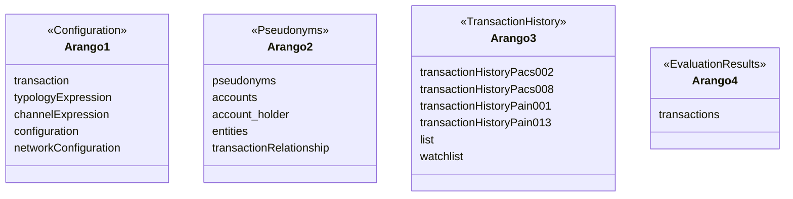

# ArangoDB SplitDB Performance Report

## Table of Contents

1. [Overview](#overview)
2. [ArangoDB Instances](#arangodb-instances)
   - [Arango 1 - Configuration/NetworkMap Database](#arango-1---configurationnetworkmap-database)
   - [Arango 2 - Pseudonyms Database](#arango-2---pseudonyms-database)
   - [Arango 3 - Transaction History Database](#arango-3---transaction-history-database)
   - [Arango 4 - Evaluation Results Database](#arango-4---evaluation-results-database)
3. [Test Environment](#test-environment)
   - [List of Applications](#list-of-applications)
   - [Application Deployment Configuration](#application-deployment-configuration)
   - [Database Component](#database-component)
   - [Cluster Uptime & Costs](#cluster-uptime--costs)
   - [3 year Reserved Costing](#3-year-reserved-costing)
4. [Test Execution](#test-execution)
   - [1. SplitDB Configuration & Metrics](#1-splitdb-configuration--metrics)
   - [2. Read Queries Performance](#2-read-queries-performance)
   - [3. Write Operations Performance](#3-write-operations-performance)
   - [4. Database Scaling](#4-database-scaling)
   - [5. Network Typology Optimization](#5-network-typology-optimization)
   - [6. MaxCPU](#6-maxcpu)
     - [Description of `maxCPU` Parameter](#description-of-maxcpu-parameter)
     - [How `maxCPU` Works](#how-maxcpu-works)
     - [Key Points](#key-points)
     - [Benefits](#benefits)
5. [Benchmarking Results](#benchmarking-results)
   - [Benchmarking Results](#benchmarking-results)
   - [Jmeter Setup](#jmeter-setup)
   - [Pod Counts](#pod-counts)
6. [Attachments and Supporting Documents](#attachments-and-supporting-documents)
   - [Jmeter Statistics](#jmeter-statistics)
   - [E2E Results](#e2e-results)
   - [Typology Results](#typology-results)
   - [Rule Results](#rule-results)
7. [Analysis of Azure VMS CPU Utilization Graphs](#analysis-of-azure-vms-cpu-utilization-graphs)
   - [Graph 1: Max Percentage CPU for NATS](#graph-1-max-percentage-cpu-for-NATS)
   - [Graph 2: Max Percentage CPU for REDIS](#graph-2-max-percentage-cpu-for-Redis)
   - [Graph 3: Max Percentage CPU for CRSP](#graph-3-max-percentage-cpu-for-CRSP)
   - [Graph 4: Max Percentage CPU for RULES](#graph-4-max-percentage-cpu-for-RULES)
   - [Graph 5: Max Percentage CPU for TADP](#graph-5-max-percentage-cpu-for-TADP)
   - [Graph 6: Max Percentage CPU for TMS](#graph-6-max-percentage-cpu-for-TMS)
   - [Graph 7: Max Percentage CPU for TP](#graph-7-max-percentage-cpu-for-TP)
   - [Graph 7: Max Percentage CPU for ARANGO](#graph-8-max-percentage-cpu-for-ARANGO)
8. [Conclusions and Recommendations](#conclusions-and-recommendations)

## Overview

This document outlines the architecture of a split database setup using four separate instances of ArangoDB and the performance outcomes on Azure cloud testing to evaluate the efficiency of read and write operations within a splitdb environment, using JMeter as the tool to generate the workload. The main points of consideration were the CPU utilization on Azure nodes, write operation throughput and impact of scaling operations.

## ArangoDB Instances


<details>
  <summary>Mermaid</summary>
  

</details>

**Each arangodb explained below is on its own VM . The single instance of Arango used 1 VM with all the configuration inside that one instance of Arango.**

### Arango 1 - Configuration/NetworkMap Database

The first instance, **Arango 1**, is responsible for storing configuration-related data. It contains the following databases and collections:

**Configuration**
- `transaction`
- `typologyExpression`
- `channelExpression`
- `configuration`

These collections are used for storing and retrieving configuration settings that dictate transaction processing and management rules.

**NetworkMap**

- `networkConfiguration`

This collection is crucial for maintaining the structural data of the network configurations.

### Arango 2 - Pseudonyms Database

**Arango 2** focuses on pseudonymity and identity management within the system. The collections housed here are:

- `pseudonyms`
- `accounts`
- `account_holder`
- `entities`
- `transactionRelationship`

This instance is integral for privacy and identity management, ensuring that user data is mapped and managed securely.

### Arango 3 - Transaction History Database

The **Arango 3** instance is tailored for transaction history storage. It includes:

- `transactionHistoryPacs002`
- `transactionHistoryPacs008`
- `transactionHistoryPain001`
- `transactionHistoryPain013`
- `list`
- `watchlist`

This instance serves as a historical data store, capturing all transaction details for auditing and reporting purposes.

### Arango 4 - Evaluation Results Database

Lastly, **Arango 4** is dedicated to storing evaluation results in the `transactions` collection. It holds the output of transaction evaluations, serving as a data store for post-transaction analysis.

## Test Environment

- ArangoDB SplitDB test
- SPlitDB Configuration: 3 nodes with 96 vCPUs and 1 node 32vCPUs
- Load Testing Tool: Apache JMeter
- Deployment: Azure Kubernetes Service (AKS)

### List of Applications
- **NATS**: High-performance messaging system.
- **ArangoDB**: Multi-model database system.
- **Redis**: In-memory data structure store.
- **Typology Processor (TP)**: Calculates a typology score for any and every typology in the platform.
- **Transaction Aggregation Decisioning Processor (TADP)**: Aggregates and decides on transaction data.
- **Transaction Monitoring Service (TMS)**: Analyzes transaction data.
- **Channel Router Setup Processor (CRSP)**: Determines which channels and typologies a transaction must be submitted for processing.

### Application Deployment Configuration
The deployment configuration for each application across the servers is as follows:

| Processor/Service Deployment              | Node Spec | Node Count | Cost Per Hour $ | Additional Notes        |
|-------------------------------------------|-----------|------------|-----------------|-------------------------|
| **Transaction Monitoring Service (TMS)**  | F32s v2   | 5          | 1.353           | 32 CPU / 64 gigs RAM    |
| **Channel Router Setup Processor (CRSP)** | F32s v2   | 4          | 1.353           | 32 CPU / 64 gigs RAM    |
| **Typology Processor (TP)**               | F32s v2   | 8          | 1.353           | 32 CPU / 64 gigs RAM    |
| **Transaction Aggregation Decisioning Processor (TADP)** | F32s v2   | 5          | 1.353           | 32 CPU / 64 gigs RAM    |
| **Rule processors**                       | F32s v2   | 8          | 1.353           | 32 CPU / 64 gigs RAM    |
| **Redis**                                 | F32s v2   | 3          | 1.353           | 32 CPU / 64 gigs RAM    |
| **NATS**                                  | F32s v2   | 3          | 1.353           | 32 CPU / 64 gigs RAM    |
| **ArangoDB (Config)**                     | F32s v2   | 1          | 1.353           | 32 CPU / 64 gigs RAM    |
| **ArangoDB (History / Pseudonym and EvalResults)** | D96s_v5 | 3          | 4.86            | 96 CPU / 320 gigs RAM   |
|<span style="color:green;">**Total**</span>|           | **40**     | **68.70**       |                         |
| **JMeter**                                 | D8as_V4   | 10         | 0.4             | 8 CPU / 32 gigs RAM     |
|<span style="color:green;">**Total**</span>|           | **10**     | **4**           |                         |
| **Corends**                               | D4s_V3    | 4          | 0.23            | 4 CPU / 16 gigs RAM     |
|<span style="color:green;">**Total**</span>|           | **4**      | **0.92**        |                         |

| Database Component| Disk Type | Disk Count | Total Disk Price | Additional Notes     |
|---------------------|-----------|------------|------------------|----------------------|  
| **Storage Account** |           |            | 0.00188 per GB |The loads sent through wont use more than one gig   
| **Managed Disks**   | SSD       | 1          | 0.000127          |                     |
| **Managed Disks**   | Ultra     | 3          | 0.000085          |                     |
|<span style="color:green;">**Total**</span>|           | **4**      | 0.000508          |                     |

| Cluster Uptime & Costs                    |           |
|-------------------------------------------|-----------|
| **Setup Time (Hours)**                    | 1         |
| **Testing Duration (Hours)**              | 7         |
| **Total Uptime (Hours)**                  | 8         |
| **Total Cost Per Hour**                   | $73.62    |
| **Total Cost Per Day**                    | $588.96   | 

### 3 year Reserved Costing

|Spec | Node Count | Cost Per Month $ | Additional Notes        |
-----------|-------|-----------------|-------------------------|
| Azure K8s  | 4     | 483.25        | 4 CPU / 16 gigs RAM    |
| F32s v2    | 37    | 4317.23       | 32 CPU / 64 gigs RAM    |
| D96s_v5    | 3     | 13393.99      | 96 CPU / 320 gigs RAM   |
|<span style="color:green;">**Total**</span>|           | **18194.49**      | 


### Test Execution
#### 1. SplitDB Configuration & Metrics
- The Arango SplitDB set up with 3 96 vCPUs and 1 32 vCPU for the configuration database.
- The Config , transaction History and Evaluation databases only used about 20% of its CPU . The Pseudonyms database was using about 50% of its CPU at peak.
- Metrics were gathered from the Azure dashboard, showing CPU usage.
#### 2. Read Queries Performance
- Processing times for read queries were found to be slow but faster than the clustered and single instance of Arango due to splitting up the load to different VM's.
- The Azure metrics indicated that as the CPU load increased on the Arango nodes(VM's), the read operation latencies also increased, leading to performance bottlenecks.
- Read operations are split unevenly across the transaction history and pseudonyms databases due to the different rules looking for information in either the transaction history database , the pseudonyms database or both.
#### 3. Write Operations Performance
- JMeter tests showed that write operations to ArangoDB were completed quickly, with an ingestion rate of 3525 messages per second.
- All transactions were submitted to the Transaction Monitoring Service (TMS) within a 1-minute timeframe, indicating that the writes were not affected by the issues impacting read operations.
- Write operations are to the pseudonyms and transaction history databases.
- **Differences in ingestion rate through TMS can be seen in the different arango deployments** [performance-benchmarking-of-arangodb-single-instance-vs-split-databases-vs-clustering](https://github.com/frmscoe/docs/blob/main/Technical/Performance-Benchmarking/performance-benchmarking-of-arangodb-single-instance-vs-split-databases-vs-clustering.md) 
#### 4. Database Scaling
- 4 database instances.
- An additional Azure node was provisioned to host the new database instance, aimed at distributing the load and improving read query performance.
#### 5. Network Typology Optimization
- The typologies were changed from 26 to 6  to improve the performance of the Typology Processor and the Transaction Aggregatorand Decision Processor.
- This change was made in response to the observed delays in rule processing.

#### 6. MaxCPU
- The Node CPU consumption on the processors were never maxing out like they did on the single instance of arango benchmarking runs - which was a result in performance optimizations in the processors and reading from Cache.
- Scaled maxCPU parameter from 1 to 2 to consume more CPU's on the processors to increase performance.
  - In the previous benchmarking runs the maxCPU parameter was set to 1 and always resulted in very high CPU consumption on the processors. This wasn't seen in the splitDB runs (ie: Much lower CPU usage) which is why i changed the MaxCPU parameter from 1 to 2 . to increase their consumption. 

##### Description of `maxCPU` Parameter

The `maxCPU` parameter in this Node.js application is used to control the number of worker processes that are spawned within a single Kubernetes pod. This parameter is crucial for scaling the application efficiently without the need to scale up additional pods. Here is a detailed explanation of how it works:

##### How `maxCPU` Works:

1. **Determine Number of CPUs:**
   - The `numCPUs` variable is set based on the value of `configuration.maxCPU`. If `maxCPU` is defined and greater than the number of CPUs available on the machine (`os.cpus().length`), it uses that value; otherwise, it defaults to using the number of available CPUs plus one.

   ```javascript
   const numCPUs = os.cpus().length > configuration.maxCPU ? configuration.maxCPU + 1 : os.cpus().length + 1;
   ```

2. **Primary Process:**
   - If the process is the primary one (`cluster.isPrimary`) and `maxCPU` is not set to 1, it logs that the primary process is running and proceeds to fork worker processes.

   ```javascript
   if (cluster.isPrimary && configuration.maxCPU !== 1) {
       loggerService.log(`Primary ${process.pid} is running`);
   ```

3. **Fork Workers:**
   - The primary process forks multiple worker processes based on the `numCPUs` value determined earlier. This is where the actual scaling happens within the same pod.

   ```javascript
   for (let i = 1; i < numCPUs; i++) {
       cluster.fork();
   }
   ```

4. **Worker Exit Handling:**
   - If any worker process exits, a new one is forked to maintain the desired number of workers.

   ```javascript
   cluster.on('exit', (worker, code, signal) => {
       loggerService.log(`worker ${Number(worker.process.pid)} died, starting another worker`);
       cluster.fork();
   });
   ```

5. **Non-Primary Process:**
   - If the process is not the primary one, it checks the environment configuration and starts the necessary services.

   ```javascript
   } else {
       (async () => {
           try {
               if (configuration.env !== 'test') {
                   await dbInit();
                   await runServer();
               }
           } catch (err) {
               loggerService.error(`Error while starting services on worker ${process.pid}`, err);
               process.exit(1);
           }
       })();
       loggerService.log(`Worker ${process.pid} started`);
   }
   ```

##### Key Points:

- **Single Instance (`maxCPU` = 1):**
  - When `maxCPU` is set to 1, only one instance of the Node.js application runs within the pod. This means there will be no worker processes forked, and the application runs as a single-threaded process.

- **Multiple Instances (`maxCPU` > 1):**
  - When `maxCPU` is set to a value greater than 1, multiple instances of the Node.js application run within the same pod. This is achieved by forking worker processes, effectively scaling the application horizontally within the same pod. For example, if `maxCPU` is set to 3, there will be 3 worker processes running in addition to the primary process, resulting in 4 instances in total.

##### Benefits:

- **Efficient Resource Utilization:** By controlling the number of worker processes within a pod, you can make better use of the available CPU resources without the need for additional pods.
- **Scalability:** This approach allows you to scale the application horizontally within a single pod, improving performance and handling higher loads.
- **Flexibility:** The ability to adjust the `maxCPU` parameter provides flexibility in how you scale your application, allowing for fine-tuning based on the specific needs and constraints of your environment.

### Benchmarking Results
Benchmarking involves sending transactions through the system to replicate real-life scenarios. Below are the details of the scaled applications and their configurations:

**ELK Stack** - <span style="color:red;">**Disabled**</span>

**TPS - 3525.23** 

**FTPS - 2496.83** 

**210 000 transactions processed in 83.99 seconds**

**Jmeter Setup:**
| Jmeter Pod Count | Threads | Iterations per thread | Total iterations (Transactions) | Total Financial Transactions |
|------------------|---------|-----------------------|------------------|------------------------------|
| 10               | 100     | 210                   | 420 000          | 210 000                      | 

<span style="color:red;">**Note:**</span> **Each processor is set to MaxCPU = 2 to maximize CPU utilization.**

**Pod Counts:**
| TMS | CRSP | # Rules | Rule Pods | # Typologies | TP | TADP | REDIS | NATS | ArangoDB |
|-----|------|---------|-----------|--------------|----|------|-------|------|----------|
| 100 | 150  | 23      | 16        | 6            | 400  | 400   | 60     | 12    | 4        |


## Attachments and Supporting Documents
- ArangoDB Dashboard screenshots
- JMeter test results
- Azure performance metrics screenshots
- JSON files with detailed performance metrics

<details>
  <summary>Jmeter Statistics</summary>
<pre language="json">
{
  "HTTP pacs002 Request" : {
    "transaction" : "HTTP pacs002 Request",
    "sampleCount" : 210000,
    "errorCount" : 0,
    "errorPct" : 0.0,
    "meanResTime" : 16.341590476190635,
    "medianResTime" : 9.0,
    "minResTime" : 3.0,
    "maxResTime" : 498.0,
    "pct1ResTime" : 17.0,
    "pct2ResTime" : 21.0,
    "pct3ResTime" : 74.0,
    "throughput" : 3527.2510673575132,
    "receivedKBytesPerSec" : 3290.6804060071245,
    "sentKBytesPerSec" : 8092.218112451425
  },
  "HTTP pacs008 Request" : {
    "transaction" : "HTTP pacs008 Request",
    "sampleCount" : 210000,
    "errorCount" : 0,
    "errorPct" : 0.0,
    "meanResTime" : 40.83254285714323,
    "medianResTime" : 28.0,
    "minResTime" : 5.0,
    "maxResTime" : 1047.0,
    "pct1ResTime" : 45.0,
    "pct2ResTime" : 78.0,
    "pct3ResTime" : 102.0,
    "throughput" : 3523.2443276163354,
    "receivedKBytesPerSec" : 6742.5854313636655,
    "sentKBytesPerSec" : 17755.69618269044
  },
  "Total" : {
    "transaction" : "Total",
    "sampleCount" : 420000,
    "errorCount" : 0,
    "errorPct" : 0.0,
    "meanResTime" : 28.587066666666377,
    "medianResTime" : 21.0,
    "minResTime" : 3.0,
    "maxResTime" : 1047.0,
    "pct1ResTime" : 33.0,
    "pct2ResTime" : 42.0,
    "pct3ResTime" : 91.0,
    "throughput" : 7050.487201721321,
    "receivedKBytesPerSec" : 10029.462602931422,
    "sentKBytesPerSec" : 25838.390589358223
  }
}
</pre>
</details>

<details>
  <summary>E2E Results</summary>
<pre language="json">
[
   {
      "startTime":"2024-06-04T15:16:55.624Z",
      "endTime":"2024-06-04T15:18:19.790Z",
      "amount":209734,
      "elapsed":84,
      "ftps":2496.8333333333335,
      "TMSStats":[
         {
            "mn":2.472165,
            "mx":1384.909064,
            "ave":12.650283793204727,
            "mea":8.0592315,
            "ninety":18.816924,
            "ninetynine":56.299422
         }
      ],
      "CRSPStats":[
         {
            "mn":0.066502,
            "mx":28.868027,
            "ave":0.12943702493634796,
            "mea":0.1097025,
            "ninety":0.159903,
            "ninetynine":0.262403
         }
      ],
      "TPStats":[
         {
            "mn":0.058101,
            "mx":1424.011354,
            "ave":0.9941893043555046,
            "mea":0.326906,
            "ninety":2.262551,
            "ninetynine":12.509207
         }
      ],
      "TADPStats":[
         {
            "mn":1.307124,
            "mx":578.523762,
            "ave":4.2894723433301225,
            "mea":2.1575375,
            "ninety":5.894816,
            "ninetynine":39.106534
         }
      ]
   }
]
</pre>
</details>

<details>
  <summary>Typology Results</summary>
<pre language="json">
[
   [
      {
         "typologyId":"028@1.0.0",
         "pcrgTm":{
            "mn":0.111903,
            "mx":137.458595,
            "ave":0.23635505984536648
         }
      },
      {
         "typologyId":"037@1.0.0",
         "pcrgTm":{
            "mn":0.099302,
            "mx":145.159369,
            "ave":0.22755116771673445
         }
      },
      {
         "typologyId":"044@1.0.0",
         "pcrgTm":{
            "mn":0.093403,
            "mx":60.321459,
            "ave":0.23293783756052186
         }
      },
      {
         "typologyId":"047@1.0.0",
         "pcrgTm":{
            "mn":0.074102,
            "mx":1424.011354,
            "ave":0.20198902018169246
         }
      },
      {
         "typologyId":"095@1.0.0",
         "pcrgTm":{
            "mn":0.058101,
            "mx":166.151141,
            "ave":0.16023746898903193
         }
      },
      {
         "typologyId":"185@1.0.0",
         "pcrgTm":{
            "mn":0.066001,
            "mx":179.999053,
            "ave":0.17655784176439449
         }
      }
   ]
]
</pre>
</details>

<details>
  <summary>Rule Results</summary>
<pre language="json">
[
   [
      {
         "ruleId":"001@1.0.0",
         "pcrgTm":{
            "mn":0.285404,
            "mx":48.507559,
            "ave":5.6410194537457965
         }
      },
      {
         "ruleId":"003@1.0.0",
         "pcrgTm":{
            "mn":0.461703,
            "mx":1047.250824,
            "ave":5.662649381847493
         }
      },
      {
         "ruleId":"004@1.0.0",
         "pcrgTm":{
            "mn":0.464005,
            "mx":1050.889407,
            "ave":5.668136525666342
         }
      },
      {
         "ruleId":"006@1.0.0",
         "pcrgTm":{
            "mn":0.348706,
            "mx":1444.151114,
            "ave":5.464872304763949
         }
      },
      {
         "ruleId":"007@1.0.0",
         "pcrgTm":{
            "mn":0.462911,
            "mx":1042.167066,
            "ave":5.355660705665237
         }
      },
      {
         "ruleId":"008@1.0.0",
         "pcrgTm":{
            "mn":0.663108,
            "mx":47.359632,
            "ave":5.342816623716786
         }
      },
      {
         "ruleId":"010@1.0.0",
         "pcrgTm":{
            "mn":0.651109,
            "mx":1043.065197,
            "ave":5.365783594678063
         }
      },
      {
         "ruleId":"011@1.0.0",
         "pcrgTm":{
            "mn":0.491506,
            "mx":46.341512,
            "ave":5.365500844165486
         }
      },
      {
         "ruleId":"016@1.0.0",
         "pcrgTm":{
            "mn":0.347908,
            "mx":1040.274874,
            "ave":5.331756582391742
         }
      },
      {
         "ruleId":"017@1.0.0",
         "pcrgTm":{
            "mn":0.355808,
            "mx":47.928598,
            "ave":5.339621210302149
         }
      },
      {
         "ruleId":"018@1.0.0",
         "pcrgTm":{
            "mn":0.352409,
            "mx":1445.053024,
            "ave":5.491574793593505
         }
      },
      {
         "ruleId":"020@1.0.0",
         "pcrgTm":{
            "mn":0.484412,
            "mx":1443.411684,
            "ave":5.484117952848456
         }
      },
      {
         "ruleId":"021@1.0.0",
         "pcrgTm":{
            "mn":0.495808,
            "mx":47.291114,
            "ave":5.48001259290174
         }
      },
      {
         "ruleId":"024@1.0.0",
         "pcrgTm":{
            "mn":0.670317,
            "mx":1450.582894,
            "ave":5.437627297950314
         }
      },
      {
         "ruleId":"026@1.0.0",
         "pcrgTm":{
            "mn":0.547011,
            "mx":52.046978,
            "ave":5.4464532991913055
         }
      },
      {
         "ruleId":"030@1.0.0",
         "pcrgTm":{
            "mn":0.478806,
            "mx":46.524069,
            "ave":5.331704409425318
         }
      },
      {
         "ruleId":"044@1.0.0",
         "pcrgTm":{
            "mn":0.561813,
            "mx":46.727582,
            "ave":5.330344745683322
         }
      },
      {
         "ruleId":"045@1.0.0",
         "pcrgTm":{
            "mn":0.407705,
            "mx":1446.019938,
            "ave":5.295632345163491
         }
      },
      {
         "ruleId":"048@1.0.0",
         "pcrgTm":{
            "mn":0.647011,
            "mx":1442.796469,
            "ave":5.453452345886866
         }
      },
      {
         "ruleId":"063@1.0.0",
         "pcrgTm":{
            "mn":0.579109,
            "mx":1444.119047,
            "ave":5.392713577877199
         }
      },
      {
         "ruleId":"076@1.0.0",
         "pcrgTm":{
            "mn":0.380909,
            "mx":47.289631,
            "ave":5.338893640765865
         }
      },
      {
         "ruleId":"083@1.0.0",
         "pcrgTm":{
            "mn":0.42231,
            "mx":1437.68889,
            "ave":5.298740350862213
         }
      },
      {
         "ruleId":"084@1.0.0",
         "pcrgTm":{
            "mn":0.564714,
            "mx":47.443165,
            "ave":5.3197971069793395
         }
      }
   ]
]
</pre>
</details>

### Analysis of Azure VMS CPU Utilization Graphs

---

#### What are These Graphs?

These graphs show the maximum CPU utilization percentages for various Virtual Machine Scale Sets (VMSS) in an Azure Kubernetes Service (AKS) cluster. Each graph represents the CPU usage over a specific period, indicating how different virtual machines (VMs) within the scale sets are performing.

#### Why Are These Graphs Important?

1. **Performance Monitoring:** These graphs help in tracking the CPU usage of different VMs to identify and resolve performance issues.
2. **Resource Management:** By monitoring CPU usage, you can ensure efficient use of CPU resources across the VMs.
3. **Operational Insights:** They provide insights into the CPU demands of different components of the cluster, helping in optimizing resource allocation and preventing resource exhaustion.
4. **Bottleneck Identification:** By observing which components are using the most CPU, you can pinpoint potential bottlenecks and areas that may require optimization.
5. **Troubleshooting:** These graphs help in identifying performance issues related to CPU usage, enabling quicker resolutions.

#### What Am I Looking At?

- **Y-Axis:** Represents the CPU utilization percentage, which can range from 0% to 100%.
- **X-Axis:** Represents the time period over which the CPU utilization is measured.
- **Colored Lines:** Each line corresponds to a different VM within the VMSS, showing its CPU usage over time. The legend below the graph indicates which color corresponds to which VM.

#### What Should I Pay Attention To?

1. **CPU Spikes:** Look for any sudden increases in CPU usage which might indicate a performance issue or a spike in demand.
2. **Sustained High CPU Usage:** Identify any VMs with consistently high CPU usage, which may need optimization or scaling.
3. **Low CPU Usage:** VMs with consistently low CPU usage might indicate over-provisioning.
4. **Comparative Analysis:** Compare CPU usage across different VMs to identify any outliers or anomalies.
5. **Time Correlation:** Note the times when CPU usage peaks occur. Correlate these times with any specific operations or workloads to understand what is causing the increased load.

By closely monitoring and analyzing these graphs, you can gain valuable insights into the performance and health of your AKS cluster, enabling you to make informed decisions to improve its efficiency and reliability.

---

### Individual Graph Summaries:

1. **Graph 1: Max Percentage CPU for NATS**
   - **Observation:** Spikes around specific times indicating temporary increases in CPU usage.
   - **Attention Points:** Sudden spikes, sustained high usage, comparison across VMs.

2. **Graph 2: Max Percentage CPU for Redis**
   - **Observation:** Moderate CPU usage with spikes indicating varying load levels.
   - **Attention Points:** Sharp increases, consistent high usage, low usage patterns.

3. **Graph 3: Max Percentage CPU for CRSP**
   - **Observation:** Notable spikes and varying usage across VMs.
   - **Attention Points:** Unusual spikes, high usage patterns, comparative analysis.

4. **Graph 4: Max Percentage CPU for RULES**
   - **Observation:** High usage indicating heavy processing loads at specific times.
   - **Attention Points:** High CPU spikes, consistent high usage, anomalies.

5. **Graph 5: Max Percentage CPU for TADP**
   - **Observation:** Significant spikes and high CPU usage indicating intensive tasks.
   - **Attention Points:** Sharp increases, sustained high usage, low usage patterns.

6. **Graph 6: Max Percentage CPU for TMS**
   - **Observation:** Varying CPU usage with notable spikes.
   - **Attention Points:** Unusual spikes, high usage patterns, comparative analysis.

7. **Graph 7: Max Percentage CPU for TP**
   - **Observation:** High usage with consistent spikes indicating demanding tasks.
   - **Attention Points:** Sharp increases, sustained high usage, low usage patterns.

8. **Graph 8: Max Percentage CPU for ARANGO**
   - **Observation:** The graph shows a significant spike for the `Pseudonyms` VM , with other VMs showing minimal CPU usage.
   - **Attention Points:** High spike for `Pseudonyms` indicating a temporary high demand or intensive task, while other VMs have relatively low CPU usage.

By maintaining a close watch on these metrics, you can ensure your AKS cluster operates efficiently, manage resources effectively, and preemptively address any potential performance issues.


## Conclusions and Recommendations
The Tazama project's Azure Cloud servers provide a robust environment for testing and benchmarking the anti-fraud and money laundering system. The use of K8s facilitates efficient management of various critical applications, ensuring high performance and reliability during benchmarking.

The performance test results indicate that while ArangoDB is capable of handling high volumes of write operations efficiently, read queries present a significant challenge. 

**To mitigate these issues, the following actions are recommended:**
- **Further Investigation:** Indexing strategies to identify specific causes of read query delays.
- **Index Optimization:** Review and optimize indexes for the splitDB environment to see if arango uses all indexes , the first one picked up or the best index.
- **Different VM for Pseudonyms:** Look into using the H-Series VM which is high performance vm for the database that gets used the most.
- **Networking:** Research if networking between the different vms could cause a delay.