# CICD Pipeline

- [CICD Pipeline](#cicd-pipeline)
  - [Github](#github)
    - [Adding GitHub Workflows](#adding-github-workflows)
      - [Step 1: Creating a Workflow File](#step-1-creating-a-workflow-file)
      - [Step 2: Defining Workflow Triggers](#step-2-defining-workflow-triggers)
      - [Step 3: Defining Workflow Jobs](#step-3-defining-workflow-jobs)
      - [Step 4: Adding Workflow Actions](#step-4-adding-workflow-actions)
      - [Step 5: Saving and Committing the Workflow](#step-5-saving-and-committing-the-workflow)
    - [Adding Branch Rules](#adding-branch-rules)
      - [Running Workflows through Pull and Push Requests with Branch Rules](#running-workflows-through-pull-and-push-requests-with-branch-rules)
      - [Rule configuration setup](#rule-configuration-setup)
    - [Rules triggered on push requests](#rules-triggered-on-push-requests)
  - [Jenkins](#jenkins)
    - [How Jenkins Fires off a Deployment Build Using Git Hooks Triggered by a Push Request to the Main Branch on GitHub](#how-jenkins-fires-off-a-deployment-build-using-git-hooks-triggered-by-a-push-request-to-the-main-branch-on-github)
    - [Setting Up Slack Notifications in Jenkins to Write to Slack](#setting-up-slack-notifications-in-jenkins-to-write-to-slack)
      - [Step 1: Install the Slack Notifier Plugin](#step-1-install-the-slack-notifier-plugin)
      - [Step 2: Create a Slack App](#step-2-create-a-slack-app)
      - [Step 3: Configure Slack Integration in Jenkins](#step-3-configure-slack-integration-in-jenkins)
      - [Step 4: Configure Jenkins Jobs to Send Slack Notifications](#step-4-configure-jenkins-jobs-to-send-slack-notifications)
      - [Step 5: Test the Slack Notifications](#step-5-test-the-slack-notifications)
  - [Sonar Cloud](#sonar-cloud)
    - [An Overview and its Usage in GitHub](#an-overview-and-its-usage-in-github)
      - [Section 1: What is SonarCloud?](#section-1-what-is-sonarcloud)
      - [Section 2: Integrating SonarCloud with GitHub](#section-2-integrating-sonarcloud-with-github)
      - [Section 3: Best Practices and Additional Considerations](#section-3-best-practices-and-additional-considerations)
    - [Links referencing Sonarcloud](#links-referencing-sonarcloud)
  - [Dependabot](#dependabot)
    - [An Overview and its Usage in GitHub](#an-overview-and-its-usage-in-github-1)
      - [Section 1: What is Dependabot?](#section-1-what-is-dependabot)
      - [Section 2: Integrating Dependabot with GitHub](#section-2-integrating-dependabot-with-github)
      - [Section 3: Best Practices and Additional Considerations](#section-3-best-practices-and-additional-considerations-1)

## Github

### Adding GitHub Workflows

GitHub Workflows are a powerful feature that enables you to automate tasks and processes within your GitHub repositories. You can define custom workflows using YAML files, and they can be triggered by events such as pushes to a repository, pull requests, or scheduled intervals. This document will guide you through the process of adding GitHub Workflows, provide examples of workflows, explain how they are run through pull and push requests with public repositories that use branch rules, and demonstrate how Jenkins can automatically deploy code to a GitHub repository. Additionally, we will cover setting up Slack notifications and show examples of them displaying on Slack after a run.

#### Step 1: Creating a Workflow File

1. Open your repository in GitHub and navigate to the root directory.
2. Create a new folder named `.github/workflows`.
3. Inside the workflows folder, create a new file with a `.yml` or `.yaml` extension. For example, `example-workflow.yml`.
4. Open the workflow file in your preferred text editor.

#### Step 2: Defining Workflow Triggers

In your workflow file, you need to specify the event that triggers the workflow. Common triggers include `push` and `pull_request` events. Here's an example of a simple workflow that triggers on every push:

```git
name: Example Workflow
on:
  push:
    branches:
      - main

```

This workflow will run whenever a push event occurs on the `main` branch. You can customize the branch or branches on which the workflow should run.

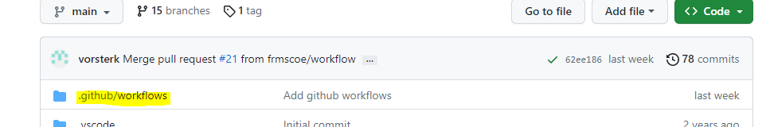

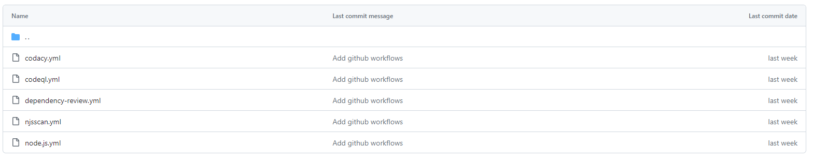
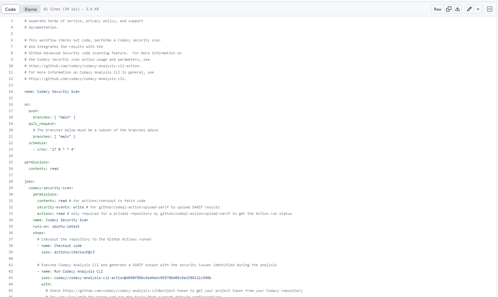

#### Step 3: Defining Workflow Jobs

A workflow can contain one or more jobs. Each job represents a set of steps to be executed. Here's an example of a workflow with a single job:

```
name: Example Workflow

on:
  push:
    branches:
      - main

jobs:
  build:
    runs-on: ubuntu-latest

    steps:
      - name: Checkout Repository
        uses: actions/checkout@v2

      - name: Build and Test
        run: |
          # Add build and test commands here

```

In this example, the workflow has a single job named "build" that runs on an `ubuntu-latest` runner. The steps inside the job perform tasks like checking out the repository's code and executing build and test commands.

#### Step 4: Adding Workflow Actions

You can include various actions within your workflow steps to perform specific tasks. GitHub provides a marketplace of pre-built actions, and you can also create your own. Here's an example of using a pre-built action to send a Slack notification:

**The integration that we have implemented ,for Slack is run through Jenkins after the build has been completed and will be notified on our Slack channel , Please refer the the jenkins/slack section if not needed.**

```
name: Example Workflow

on:
  push:
    branches:
      - main

jobs:
  build:
    runs-on: ubuntu-latest

    steps:
      - name: Checkout Repository
        uses: actions/checkout@v2

      - name: Build and Test
        run: |
          # Add build and test commands here

      - name: Slack Notification
        uses: rtCamp/action-slack-notify@v2
        with:
          status: ${{ job.status }}
          slack-bot-token: ${{ secrets.SLACK\_BOT\_TOKEN }}
          channel: general

```

In this example, the workflow uses the `rtCamp/action-slack-notify` action to send a notification to a Slack channel named `general`. It includes the status of the job (success, failure, etc.) and requires a Slack bot token stored as a secret in your repository.

#### Step 5: Saving and Committing the Workflow

Once you have defined your workflow, save the file and commit it to your repository. The workflow will automatically be enabled and run whenever the specified trigger event occurs.

Workflow changes will be change in this repo [https://github.com/frmscoe/workflows](https://github.com/frmscoe/workflows) instead of having to change it in every repository that has these workflows. Once this workflow repository has the latest changes a few commands need to be run in order to update the rest of the repositories.

In the projects where we want the workflow changes to be implemented.

**Step 1 : Shell**

```bash
  # Add the Workflow repo as another remote
  git remote add workflow https://github.com/frmscoe/workflows
```

**Step 2 : Shell**

```bash
	# Fetch the Workflowr configuration from theWorkflowI repo
	git fetchworkflowi
```

**Step 3 : Shell**

```bash
  # Merge the workflow repo's workflows to current repo
	git merge --allow-unrelated workflow/main 
	# We need --allow-unrelated main only once just to give git a heads up that we know we're merging from a different repo
```

After step 3, the files should appear in the current repo, you can remove or edit them as needed (on a per repo case). Then you can commit them.

**If we make edits to the workflow repository, all we need to do is to git fetch and git merge again.**

### Adding Branch Rules

#### Running Workflows through Pull and Push Requests with Branch Rules

If your repository has branch rules set up, workflows can be triggered based on these rules. For example, you can configure a branch rule that requires pull requests and runs a workflow for code review and testing.

When a pull request is created or updated, the workflow specified in the branch rules will be triggered. Similarly, pushing changes to a branch can trigger workflows associated with that branch.

#### Rule configuration setup

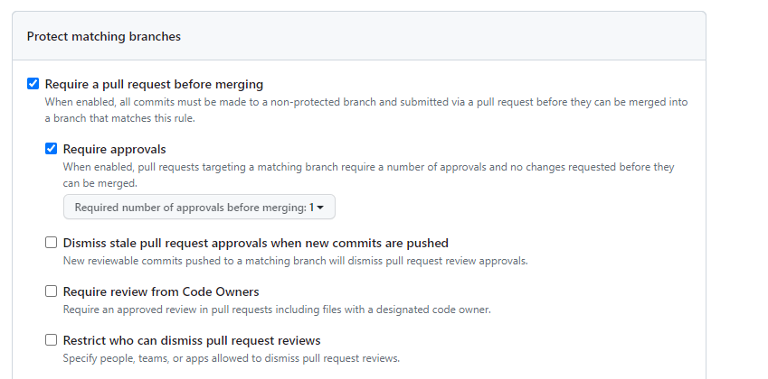

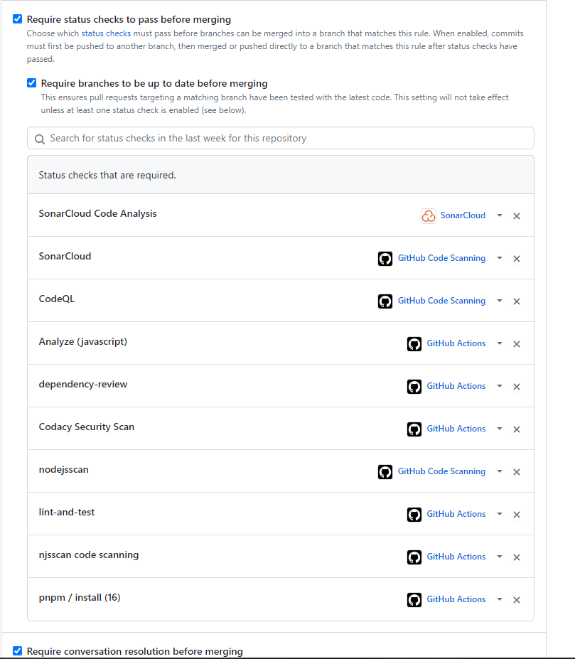
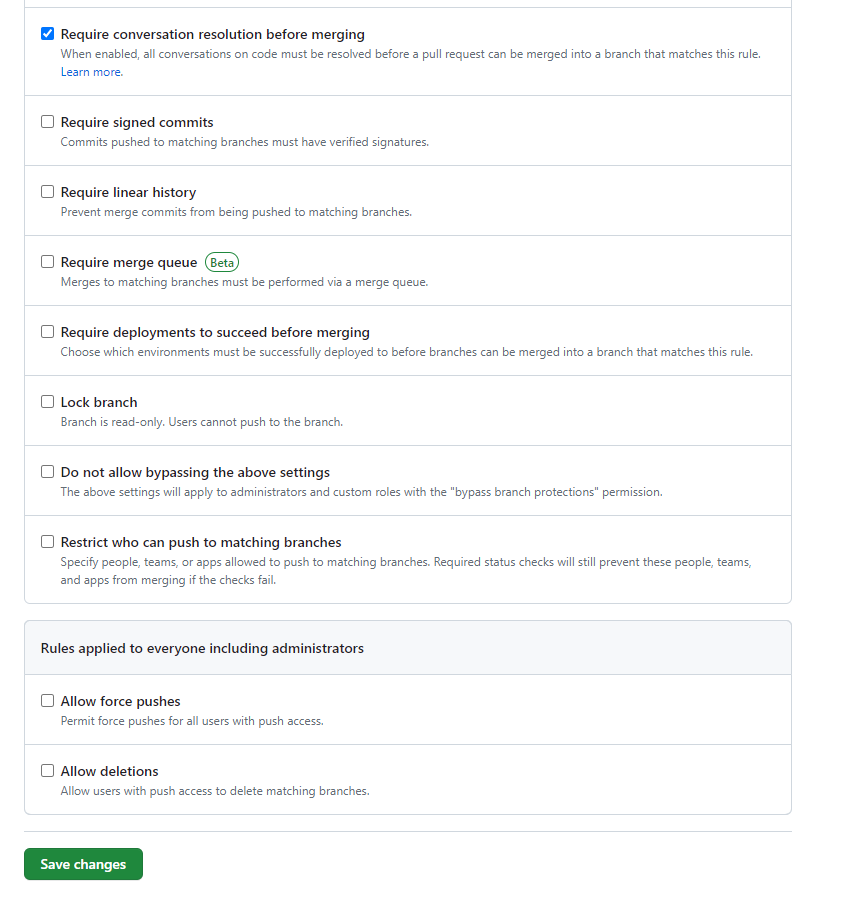

### Rules triggered on push requests

Once the code has been pushed through to the code repository , the build triggers the workflows and does the certain checks needed , if the checks fail they will need to be fixed before a merge to that main branch can be completed.

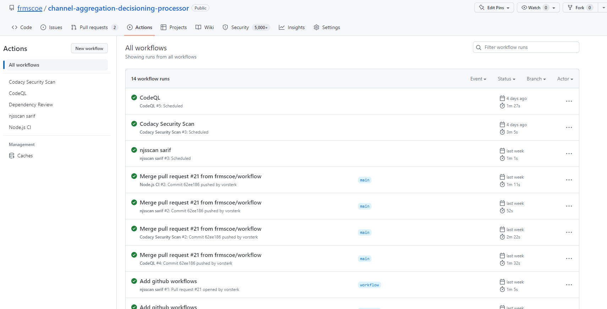

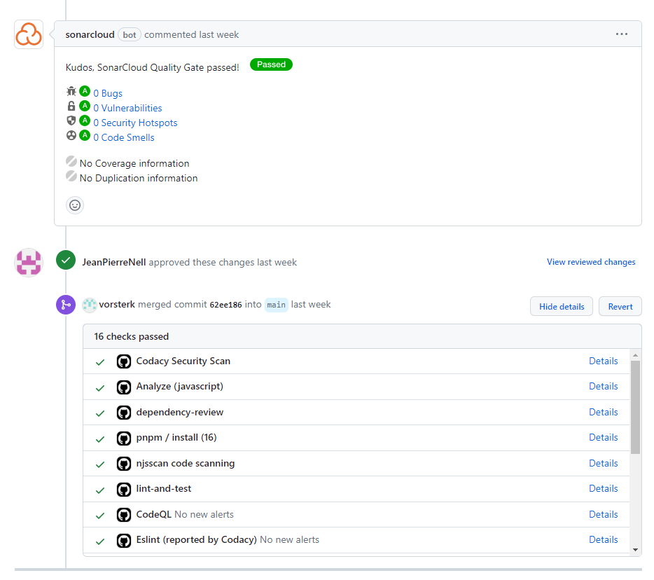

## Jenkins

This section will show the how Jenkins builds get triggered from Gibhub main branch pushesere and how to setup slack notifier in Jenk.nsi

### How Jenkins Fires off a Deployment Build Using Git Hooks Triggered by a Push Request to the Main Branch on GitHub

The following provides an explanation of how Jenkins can automatically trigger a deployment build using Git hooks when a push request is made to the main branch on GitHub. It outlines the step-by-step process involved in configuring Jenkins, setting up Git hooks, configuring webhooks in GitHub, and the subsequent triggering of the Jenkins job for deployment.

**Process Overview**

1. **Setting up Jenkins**: Ensure that a Jenkins server is properly set up and configured with the necessary plugins and access to the code repository. [https://plugins.jenkins.io/ghprb](https://plugins.jenkins.io/ghprb) [https://plugins.jenkins.io/github-pullrequest/](https://plugins.jenkins.io/github-pullrequest/)
2. **Configuring Jenkins Job**: Create a Jenkins job that defines the build and deployment process for the application. This job should be configured to build the code and package it for deployment.  
    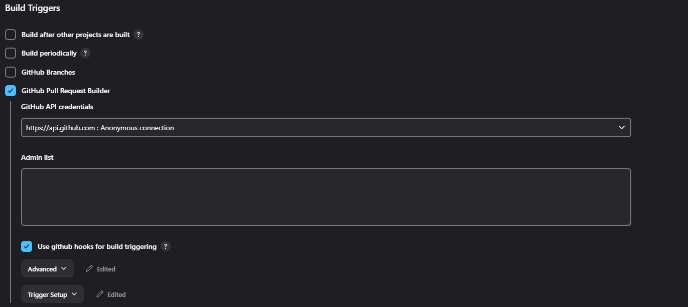
3. **Adding Git Hooks**: Set up Git hooks on your local development environment. Git hooks are scripts executed in response to specific Git events. In this case, we will use a post-receive hook that triggers a build on Jenkins when a push event occurs.
4. **Configuring Webhooks in GitHub**: Access the repository settings on GitHub and configure webhooks to communicate with the Jenkins server. Webhooks are HTTP callbacks that notify external services when specific events occur. Set up a webhook to send a payload to the Jenkins server whenever a push event happens on the main branch.  
    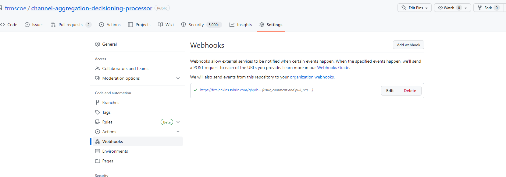
5. **Receiving Webhook Payload**: Jenkins has a built-in web server that can listen for incoming webhook payloads. Once the webhook is configured in GitHub, Jenkins will start receiving the payload whenever a push event occurs on the main branch.
6. **Jenkins Job Triggered**: Upon receiving the webhook payload, Jenkins will trigger the corresponding job that was set up earlier. This job will pull the latest changes from the repository, build the code, and package it for deployment.
7. **Deployment Process**: The Jenkins job can include steps to deploy the packaged code to the desired environment, such as a staging or production server. The specific deployment process will depend on the requirements of the application.  
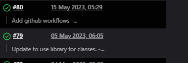

By following the outlined steps, Jenkins can be configured to fire off a deployment build using Git hooks triggered by a push request to the main branch on GitHub. This automated process streamlines the build and deployment workflow, ensuring efficient and consistent deployments of the application. Please note that the actual implementation may vary based on your specific development environment, Jenkins configuration, and repository hosting platform (in this case, GitHub).

### Setting Up Slack Notifications in Jenkins to Write to Slack

The below provides a step-by-step guide on setting up the Slack Notifier plugin in Jenkins to send notifications to Slack. By configuring this plugin, you can receive important build and deployment updates directly in your Slack workspace.

**Prerequisites**

Before proceeding with the setup, ensure you have the following:

1. Access to a Jenkins server with administrative privileges.
2. A Slack workspace where you have the necessary permissions to install and configure apps.

#### Step 1: Install the Slack Notifier Plugin

1. Open the Jenkins dashboard.
2. Navigate to "Manage Jenkins" and select "Manage Plugins".
3. In the "Available" tab, search for "Slack Notifier" plugin.
4. Check the box next to the "[Global Slack Notifier](https://plugins.jenkins.io/global-slack-notifier)" and “[Slack NotificationSlack Notification Plugin](https://plugins.jenkins.io/slack)“ plugin and click "Instalwithout restart".

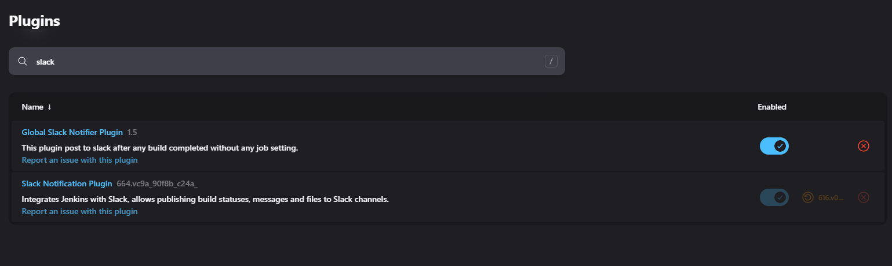

#### Step 2: Create a Slack App

1. Access your Slack workspace and navigate to the Slack App Directory.
2. Click on "Create New App" and provide a name for your app.
3. Select the workspace where you want to install the app.
4. Once created, note down the "Bot User OAuth Token" as it will be required later.

[https://plugins.jenkins.io/global-slack-notifier/](https://plugins.jenkins.io/global-slack-notifier/)

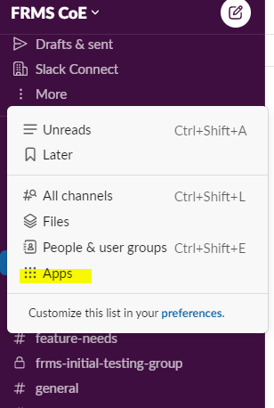
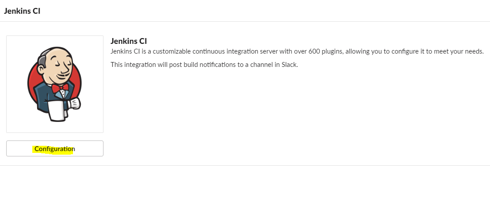

#### Step 3: Configure Slack Integration in Jenkins

1. Go back to the Jenkins dashboard and navigate to "Manage Jenkins" and select "Configure System".
2. Scroll down to the "Slack" section and click on the "Add Slack Configuration" button.
3. Provide a name for the configuration and enter the "Bot User OAuth Token" obtained from the Slack app.
4. Save the configuration.

After it's installed, click on **Manage Jenkins** again in the left navigation, and then go to **Configure System**. Find the **Global Slack Notifier Settings** section and add the following values:

- **Team Subdomain:** `Workspace` ie: Tazama
- **Integration Token Credential ID:** Create a secret text credential using `<generated token>` as the value

The other fields are optional. You can click on the question mark icons next to them for more information. Press **Save** when you're done.

> **Note:** Please remember to replace the Integration Token in the screenshot below with your own.

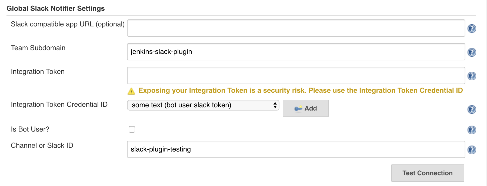

#### Step 4: Configure Jenkins Jobs to Send Slack Notifications

1. Open a Jenkins job that you want to configure for Slack notifications or create a new one.
2. Under the job configuration, scroll down to the "Post-build Actions" section.
3. Click on the "Add post-build action" dropdown and select "Send build status to Slack".
4. In the "Team and channel" field, enter the Slack channel where you want to receive notifications.
5. Customize other notification settings such as "Notify on every failure" or "Include build parameters" as per your requirements.
6. Save the job configuration.
  
**ie: For deployments jobs no post build setup is needed.**

#### Step 5: Test the Slack Notifications

1. Trigger a build for the Jenkins job you configured in Step 4.
2. Monitor the Slack channel you specified in the job configuration.
3. You should receive a notification in the Slack channel indicating the build status and any additional information based on the configured settings.
  
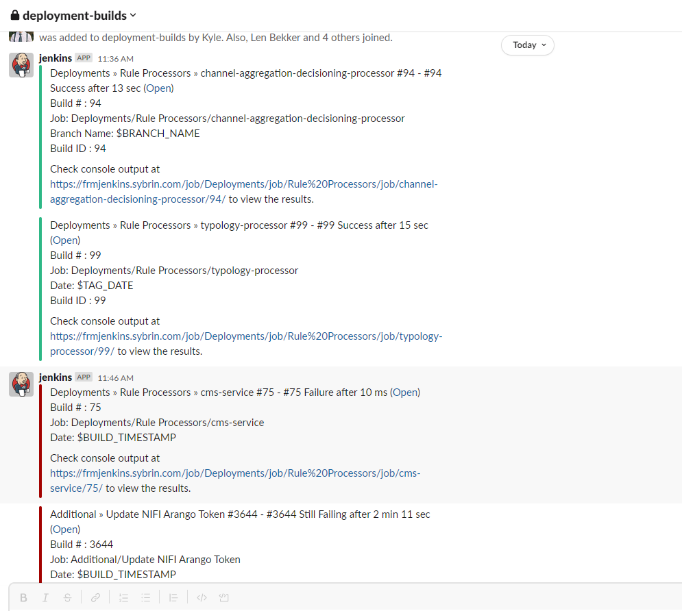

By following the steps outlined in this document, you can set up the Slack Notifier plugin in Jenkins to send build and deployment notifications to your Slack workspace. This integration enhances collaboration and keeps your team informed about the status of Jenkins jobs and builds. Ensure that you have the necessary permissions in your Slack workspace and Jenkins server to successfully complete the setup.

## Sonar Cloud

### An Overview and its Usage in GitHub

The below provides a detailed explanation of SonarCloud, a cloud-based code quality and security analysis platform, and how it is used in GitHub. SonarCloud helps developers identify and address code quality issues, security vulnerabilities, and technical debt in their projects. This document will cover the key features of SonarCloud, its integration with GitHub, and additional information to facilitate its usage effectively.

#### Section 1: What is SonarCloud?

1. SonarCloud Introduction: Briefly explain that SonarCloud is a cloud-based code analysis platform that provides insights into code quality, security, and maintainability.
2. Key Features of SonarCloud: Highlight the main features of SonarCloud, such as static code analysis, code coverage, code duplication detection, security vulnerability detection, and code smells identification.
3. Supported Programming Languages: List the programming languages supported by SonarCloud, including popular languages like Java, JavaScript, Python, C#, and others.
4. Benefits of SonarCloud: Describe the advantages of using SonarCloud, such as improved code quality, reduced technical debt, enhanced security, and better maintainability.
  
#### Section 2: Integrating SonarCloud with GitHub

1. Prerequisites: Mention the prerequisites for integrating SonarCloud with GitHub, including having a SonarCloud account and a GitHub repository.
2. Setting Up a SonarCloud Account: Provide instructions on how to create a SonarCloud account and set up a new project.
3. Configuring SonarCloud Analysis: Explain how to configure the SonarCloud analysis for a GitHub project, including setting up the SonarCloud token and configuring the analysis properties.
4. Running SonarCloud Analysis: Detail the steps to run the SonarCloud analysis either through the SonarCloud command-line interface or through a CI/CD pipeline.
5. Viewing SonarCloud Reports: Guide users on how to access and interpret the SonarCloud reports generated for the GitHub project, including code quality metrics, issues, and security vulnerabilities.
  
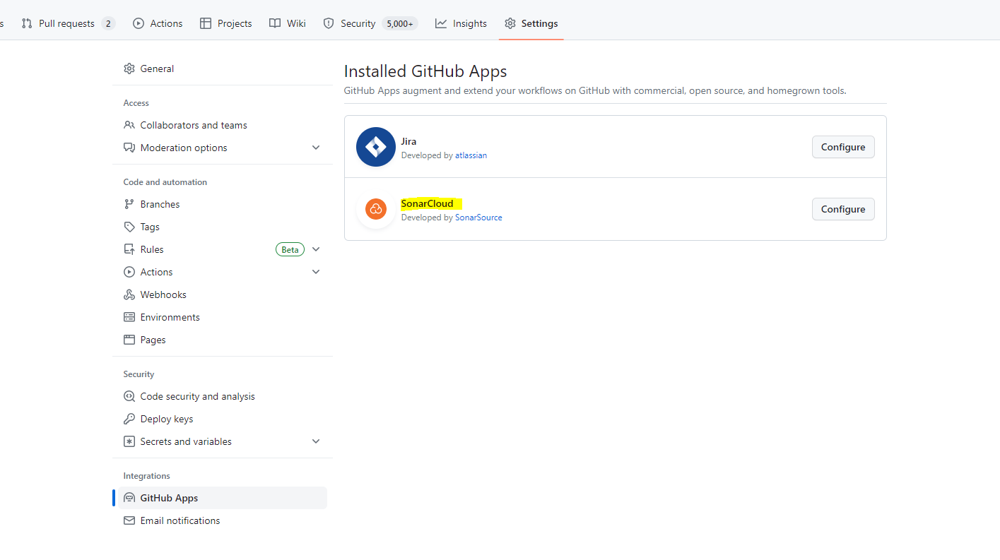

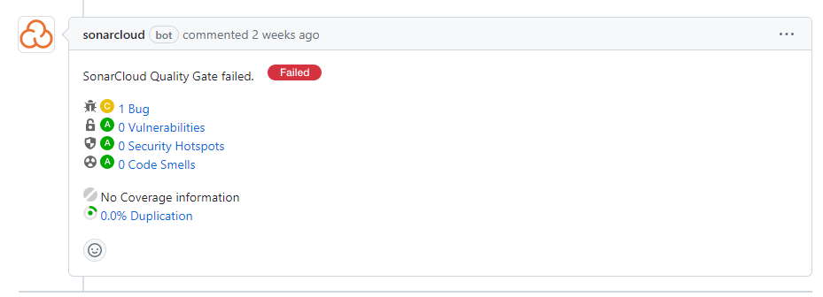

#### Section 3: Best Practices and Additional Considerations

1. Continuous Integration/Continuous Deployment (CI/CD) Integration: Highlight the importance of integrating SonarCloud into the CI/CD pipeline for automated code analysis and continuous feedback.
2. Quality Gates: Explain the concept of quality gates in SonarCloud and how they can be used to set quality and security thresholds for projects.
3. Customizing SonarCloud Rules: Discuss how SonarCloud allows users to customize the analysis rules according to their specific project requirements.
4. Remediation of Code Issues: Provide guidance on how to address and remediate code issues and security vulnerabilities identified by SonarCloud.
5. Collaboration and Integration with Pull Requests: Describe how SonarCloud integrates with pull requests in GitHub, providing early feedback on code quality and security issues before merging.
6. SonarCloud Badges: Explain the usage of SonarCloud badges to display code quality metrics on project documentation, README files, or project websites.

SonarCloud is a powerful code analysis platform that helps developers ensure code quality, identify security vulnerabilities, and reduce technical debt. By integrating SonarCloud with GitHub, developers can leverage its features and receive continuous feedback on their projects. The above has provided an overview of SonarCloud, explained its integration with GitHub, and covered additional considerations to enhance the effective usage of SonarCloud in development workflows.

### Links referencing Sonarcloud

[GitHub Actions | SonarCloud Docs](https://docs.sonarcloud.io/advanced-setup/ci-based-analysis/github-actions-for-sonarcloud/)

[SonarCloud Scan · Actions · GitHub Marketplace](https://github.com/marketplace/actions/sonarcloud-scan)

## Dependabot

### An Overview and its Usage in GitHub

Dependabot is a powerful dependency management tool, and how it is used in GitHub. Dependabot helps developers keep their projects up-to-date by automatically detecting and suggesting updates for dependencies. This document will cover the key features of Dependabot, its integration with GitHub, and additional information to facilitate its setup and usage effectively.

#### Section 1: What is Dependabot?

1. Dependabot Introduction: Briefly explain that Dependabot is a dependency management tool that automatically scans projects for outdated dependencies and suggests updates.
2. Key Features of Dependabot: Highlight the main features of Dependabot, such as automated dependency updates, support for multiple package managers, compatibility checks, version constraint resolution, and vulnerability detection.
3. Supported Package Managers: List the package managers supported by Dependabot, including popular ones like npm, Maven, pip, RubyGems, and others.
4. Benefits of Dependabot: Describe the advantages of using Dependabot, such as increased security through timely dependency updates, reduced manual effort in managing dependencies, and improved overall project stability.
  
#### Section 2: Integrating Dependabot with GitHub

1. Prerequisites: Mention the prerequisites for integrating Dependabot with GitHub, including having a GitHub repository and sufficient access privileges.
2. Enabling Dependabot: Explain how to enable Dependabot for a GitHub repository, either through the repository settings or by adding a configuration file (e.g., `dependabot.yml`).
3. Configuring Dependabot Updates: Detail the available configuration options for Dependabot, such as update frequency, update types (e.g., security updates, major updates), and version constraint resolution strategies.
4. Dependabot Version Updates: Explain how Dependabot identifies and suggests updates for outdated dependencies, including the use of version ranges and compatibility checks.
5. Security Vulnerability Detection: Discuss how Dependabot scans dependencies for known security vulnerabilities and provides alerts or recommendations for resolution.
6. Pull Requests and Automated Updates: Describe how Dependabot creates pull requests in GitHub to suggest dependency updates, allowing for manual review and merging into the codebase.
7. Merging Dependabot Updates: Provide guidance on how to handle and merge Dependabot-generated pull requests, including manual review, testing, and ensuring compatibility with the project.
8. Dependabot Notifications: Explain how developers can receive notifications or email digests from Dependabot regarding dependency updates, vulnerability alerts, and overall dependency health.
  
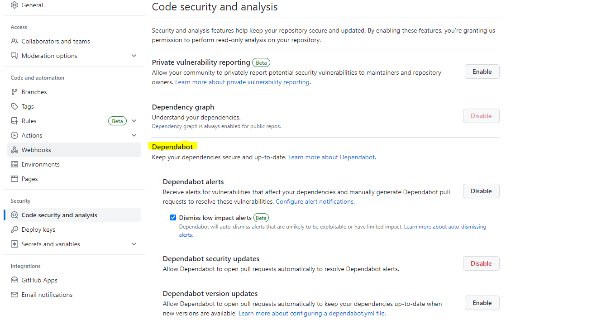
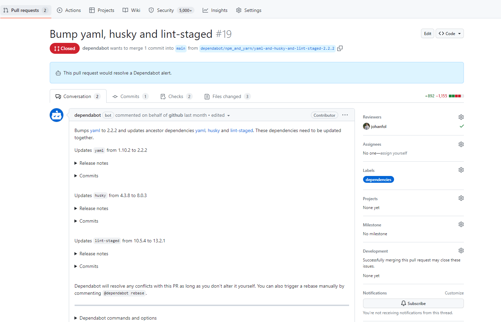

#### Section 3: Best Practices and Additional Considerations

1. Dependabot Configuration Options: Highlight additional configuration options, such as ignoring specific dependencies, excluding certain types of updates, and setting up version pinning.
2. Testing and Continuous Integration: Emphasize the importance of testing updated dependencies and integrating Dependabot within the project's CI/CD pipeline for automated testing and validation.
3. Dependency Update Workflow: Provide recommendations on establishing an efficient workflow for reviewing, testing, and merging Dependabot updates into the codebase.
4. Monitoring Dependency Health: Explain how to leverage Dependabot's reports and insights to track the overall health and status of project dependencies.
5. Manual Dependency Updates: Discuss scenarios where manual dependency updates may be necessary, such as when incompatible changes require code modifications or manual intervention.

Dependabot is a valuable tool for managing dependencies and keeping projects up-to-date with minimal effort. By integrating Dependabot with GitHub, developers can automate the process of identifying, suggesting, and merging dependency updates.
