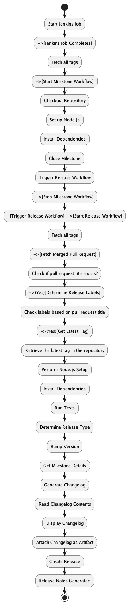
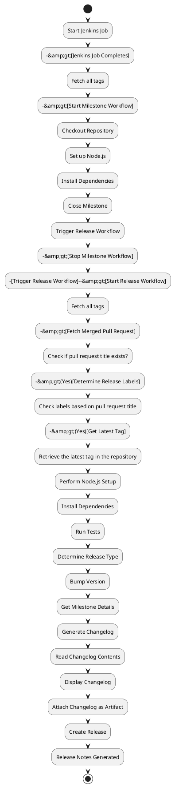
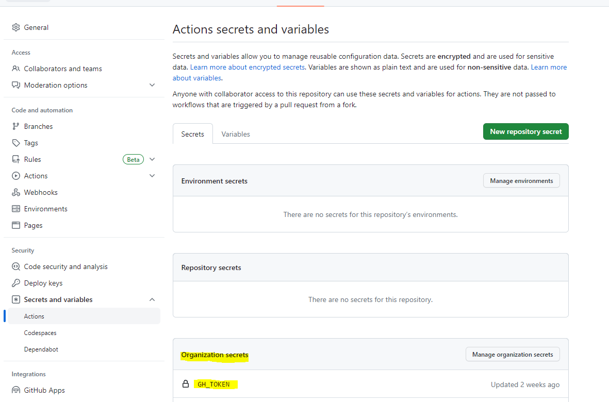

# Github Release

- [Github Release](#github-release)
  - [Creating a release on Github](#creating-a-release-on-github)
    - [Step 1: Versioning](#step-1-versioning)
    - [Step 2: Changelog](#step-2-changelog)
    - [Step 3: Release Branch](#step-3-release-branch)
    - [Step 4: Tagging](#step-4-tagging)
    - [Step 5: Release Notes](#step-5-release-notes)
  - [Release Automation/Release Workflow](#release-automationrelease-workflow)
    - [Continuous Integration (CI)](#continuous-integration-ci)
      - [Example of a milestone.yml](#example-of-a-milestoneyml)
      - [Example of a release.yml](#example-of-a-releaseyml)
      - [Explanation of the release workflow in more detail](#explanation-of-the-release-workflow-in-more-detail)
    - [Version Bumping](#version-bumping)
      - [Step 1: Install semantic-release](#step-1-install-semantic-release)
      - [Step 2: Configure\*\* \*\*semantic-release](#step-2-configure-semantic-release)
      - [Step 3: Update your commit messages](#step-3-update-your-commit-messages)
        - [Feature Addition:](#feature-addition)
        - [Bug Fix:](#bug-fix)
        - [Documentation Update:](#documentation-update)
        - [Code Refactoring:](#code-refactoring)
        - [Chore or Build Update:](#chore-or-build-update)
        - [Breaking Change:](#breaking-change)
        - [Enhancement Update:](#enhancement-update)
      - [Step 4: Add semantic-release script to your CI/CD pipeline](#step-4-add-semantic-release-script-to-your-cicd-pipeline)
      - [Step 5: Configure CI/CD environment variables](#step-5-configure-cicd-environment-variables)
      - [Step 6: Run the release process](#step-6-run-the-release-process)
    - [Integration with Changelog](#integration-with-changelog)
      - [Step 1: Create a Changelog File](#step-1-create-a-changelog-file)
      - [Step 2: Install Changelog Tool](#step-2-install-changelog-tool)
      - [Step 3: Configure Changelog Generation](#step-3-configure-changelog-generation)
      - [Step 4: Run Changelog Update Script](#step-4-run-changelog-update-script)
      - [Step 5: Commit and Push the Updated Changelog](#step-5-commit-and-push-the-updated-changelog)
    - [Release Drafts](#release-drafts)
      - [Step 1: Create a Release Draft](#step-1-create-a-release-draft)
      - [Step 2: Update the Release Draft](#step-2-update-the-release-draft)
      - [Step 3: Automate Release Draft Updates](#step-3-automate-release-draft-updates)
      - [Step 4: Publish the Release](#step-4-publish-the-release)
    - [Release Notes](#release-notes)
      - [Step 1: Determine the Format and Structure](#step-1-determine-the-format-and-structure)
      - [Step 2: Collect Information for the Release Notes](#step-2-collect-information-for-the-release-notes)
      - [Step 3: Organize the Release Notes](#step-3-organize-the-release-notes)
      - [Step 4: Include Relevant Links and References](#step-4-include-relevant-links-and-references)
      - [Step 5: Include Release Notes in the Release Process](#step-5-include-release-notes-in-the-release-process)

## Creating a release on Github

### Step 1: Versioning

Semantic versioning (SemVer) is a widely adopted versioning scheme that helps communicate the impact of changes in your releases. It consists of three components: MAJOR, MINOR, and PATCH.

- **MAJOR version**: Increment when you make incompatible API changes.
- **MINOR version**: Increment when you add new functionality in a backward-compatible manner.
- **PATCH version**: Increment when you make backward-compatible bug fixes.

You can start by defining the initial version for your project, such as 1.0.0, and then follow the SemVer guidelines to update the version number with each release.

### Step 2: Changelog

A changelog is a file that describes the changes made in each release. It provides a comprehensive overview of the updates, bug fixes, and new features. Typically, it follows a structured format with sections like Added, Changed, Fixed, and Deprecated.

For example:

```markdown
## [1.2.0] - 2023-06-13

### Added
- Implemented user authentication feature.

### Changed
- Refactored the data processing module for better performance.

### Fixed
- Resolved a critical bug that caused data loss.

## [1.1.0] - 2023-05-28

### Added
- Introduced a new reporting feature.

### Changed
- Improved the UI layout for better user experience.
```

Maintain the changelog file in your project's repository and update it with each release.

### Step 3: Release Branch

Create a dedicated branch in your version control system to manage release-related activities. Common branch names include release, main, or a name that aligns with your project's conventions. This branch should only be used for preparing and finalizing releases.

For example, you can create and switch to the release branch using Git commands:

```bash
git checkout -b release
```

### Step 4: Tagging

Tags in Git allow you to assign meaningful names to specific points in your repository's history, such as release versions. Annotated tags include additional metadata like the tagger's name, email, and a message.

To create a tag manually, you can use the following command:

```bash
git tag -a v1.0.0 -m "Version 1.0.0"
```

Alternatively, you can automate the tag creation process as part of your release automation workflow.

### Step 5: Release Notes

Release notes summarize the key changes in each release and provide an overview of what users can expect from the update. They can be added as part of the GitHub release description.

[https://docs.github.com/en/repositories/releasing-projects-on-github/automatically-generated-release-notes](https://docs.github.com/en/repositories/releasing-projects-on-github/automatically-generated-release-notes)

For example:

```markdown
# Release Notes - Version 1.2.0

- Added user authentication feature.
- Refactored the data processing module for better performance.
- Fixed a critical bug that caused data loss.
```

## Release Automation/Release Workflow

Create a release workflow within your CI system that automates the release process. This workflow should trigger after successful tests and when a new version is bumped. It can generate release artifacts, create a new release on GitHub, and publish the artifacts as release assets.




### Continuous Integration (CI)

Choose a CI system that integrates well with GitHub, such as GitHub Actions, Jenkins, or CircleCI. Set up a CI configuration file (e.g., .github/workflows/release.yml) in your repository.

Configure your CI workflow to trigger on specific events, such as a new commit pushed to the release branch or when a pull request is merged. The workflow should include steps to build and test your codebase.

#### Example of a milestone.yml

```yaml
name: Milestone Workflow

on:
  workflow_dispatch:
    inputs:
      milestoneId:
        description: 'Milestone ID'
        required: true
        default: '1'
  issues:
    types:
    - closed

jobs:
  close_milestone:
    runs-on: ubuntu-latest

    steps:
    - name: Checkout Repository
        uses: actions/checkout@v2
        
    - name: Set up Node.js
        uses: actions/setup-node@v2
        with:
          node-version: 14

    - name: Install Dependencies
        run: npm install @actions/github
        
    - name: Close Milestone
        run: |
          ACCESS_TOKEN="${{ secrets.GITHUB_TOKEN }}"
          MILESTONE_NUMBER=${{ github.event.inputs.milestoneId }}
          API_URL="https://api.github.com"
          
          curl -X PATCH \\
            -H "Accept: application/vnd.github.v3+json" \\
            -H "Authorization: Bearer $ACCESS_TOKEN" \\
            -d '{"state": "closed"}' \\
            $API_URL/repos/${{ github.repository }}/milestones/$MILESTONE_NUMBER
            
    - name: Trigger Release Workflow
        uses: peter-evans/repository-dispatch@v1
        with:
          token: ${{ secrets.GITHUB_TOKEN }}
          repository: ${{ github.repository }}
          event-type: release
          client-payload: '{"milestone_number": "${{ github.event.inputs.milestoneId }}"}'
```

#### Example of a release.yml

```yaml
name: Release Workflow

on:
  repository_dispatch:
    types: [release]
    properties:
      milestone_number:
        type: string

jobs:
  release:
    runs-on: ubuntu-latest

    steps:
    - name: Checkout Repository
        uses: actions/checkout@v2
        with:
          fetch-depth: 0 # Fetch all tags
      
      # Fetch merged pull request and determine release labels
    - uses: actions-ecosystem/action-get-merged-pull-request@v1
        id: get-merged-pull-request
        with:
          github_token: ${{ secrets.GITHUB_TOKEN }}

    - uses: actions-ecosystem/action-release-label@v1
        id: release-label
        if: ${{ steps.get-merged-pull-request.outputs.title != null }}
        with:
          github_token: ${{ secrets.GITHUB_TOKEN }}
          #labels: ${{ steps.get-merged-pull-request.outputs.labels }}

      # Get the latest tag in the repository
    - uses: actions-ecosystem/action-get-latest-tag@v1
        id: get-latest-tag
        if: ${{ steps.release-label.outputs.level != null }}
        with:
          semver_only: true

    - name: Set up Node.js
        uses: actions/setup-node@v2
        with:
          node-version: '14'

    - name: Install Dependencies
        run: npm install

    - name: Run Tests
        run: npm test
        
      # Determine the release type (major, minor, patch) based on commit messages  
    - name: Determine Release Type
        id: determine_release
        run: |
          export PREV_VERSION=$(git describe --abbrev=0 --tags)
          echo "Previous Version: $PREV_VERSION"
          
          export COMMIT_MESSAGES=$(git log $PREV_VERSION^..HEAD --format=%B)
          echo "Commit Messages: $COMMIT_MESSAGES"
          
          # Determine release type based on commit messages and labels
          RELEASE_TYPE="patch"  # Default to patch
          
          if echo "$COMMIT_MESSAGES" | grep -q -e "BREAKING CHANGE:"; then
            RELEASE_TYPE="major"
          elif echo "$COMMIT_MESSAGES" | grep -q -e "feat:"; then
            RELEASE_TYPE="minor"
          elif echo "$COMMIT_MESSAGES" | grep -q -e "feat:" && (echo "$COMMIT_MESSAGES" | grep -q -e "fix:" || echo "$COMMIT_MESSAGES" | grep -q -e "enhancement:" || echo "$COMMIT_MESSAGES" | grep -q -e "docs:" || echo "$COMMIT_MESSAGES" | grep -q -e "refactor:" || echo "$COMMIT_MESSAGES" | grep -q -e "chore:"); then
            RELEASE_TYPE="minor"
          elif echo "$COMMIT_MESSAGES" | grep -q -e "fix:" -e "enhancement:" -e "docs:" -e "refactor:" -e "chore:"; then
            RELEASE_TYPE="patch"
          fi
                    
          echo "Release Type: $RELEASE_TYPE"
          echo "::set-output name=release_type::$RELEASE_TYPE"
        
      # Bump the version based on the determined release type
    - name: Bump Version
        id: bump_version
        run: |
          export PREV_VERSION=$(git describe --abbrev=0 --tags)
          echo "Previous Version: $PREV_VERSION"
          
          export RELEASE_TYPE=${{ steps.determine_release.outputs.release_type }}
          echo "Release Type: $RELEASE_TYPE"
          
          export VERSION_PARTS=($(echo $PREV_VERSION | tr '.' '\\n'))
          MAJOR=${VERSION_PARTS[0]}
          MINOR=${VERSION_PARTS[1]}
          PATCH=${VERSION_PARTS[2]}
          
          if [[ $RELEASE_TYPE == "major" ]]; then
            MAJOR=$((MAJOR + 1))
            MINOR=0
            PATCH=0
          elif [[ $RELEASE_TYPE == "minor" ]]; then
              MINOR=$((MINOR + 1))
              PATCH=0
          else
            PATCH=$((PATCH + 1))
          fi
          
          NEW_VERSION="$MAJOR.$MINOR.$PATCH"
          echo "New Version: $NEW_VERSION"
          echo "::set-output name=new_version::$NEW_VERSION"
  
      # Get the milestone details
    - name: Get Milestone Details
        id: get_milestone
        run: |
          # Retrieve the milestone ID from the workflow input
          MILESTONE_ID=${{ github.event.client_payload.milestone_number }}
          MILESTONE_RESPONSE=$(curl -s -H "Authorization: Bearer ${{ secrets.GITHUB_TOKEN }}" "https://api.github.com/repos/${{ github.repository }}/milestones/${MILESTONE_ID}")
          MILESTONE_TITLE=$(echo "$MILESTONE_RESPONSE" | jq -r '.title')
          MILESTONE_DESCRIPTION=$(echo "$MILESTONE_RESPONSE" | jq -r '.description')
          MILESTONE_DATE=$(echo "$MILESTONE_RESPONSE" | jq -r '.due_on')
          echo "::set-output name=milestone_title::$MILESTONE_TITLE"
          echo "::set-output name=milestone_description::$MILESTONE_DESCRIPTION"
          echo "::set-output name=milestone_date::$MILESTONE_DATE"

      # Generate the changelog based on commit messages and labels
    - name: Generate Changelog
        id: generate_changelog
        run: |
          # Generate Changelog Script
          # Constants
          CHANGELOG_FILE="/home/runner/work/ReleaseManagement/changelog.txt"
          LABEL_BUG="fix:"
          LABEL_FEATURE="feat:"
          LABEL_ENHANCEMENT="enhancement:"
          LABEL_DOCS="docs:"
          LABEL_REFACTOR="refactor:"
          LABEL_CHORE="chore:"
          LABEL_BREAKING_CHANGE="BREAKING CHANGE:"
          # Get the last release tag
          LAST_RELEASE_TAG=$(git describe --abbrev=0 --tags)
          # Get the milestone details from the output of the previous step
          MILESTONE_TITLE="${{ steps.get_milestone.outputs.milestone_title }}"
          MILESTONE_DESCRIPTION="${{ steps.get_milestone.outputs.milestone_description }}"
          MILESTONE_DATE="${{ steps.get_milestone.outputs.milestone_date }}"
          # Append the milestone details to the changelog file
          echo "## Milestone: $MILESTONE_TITLE" >> "$CHANGELOG_FILE"
          echo "Date: $MILESTONE_DATE" >> "$CHANGELOG_FILE"
          echo "Description: $MILESTONE_DESCRIPTION" >> "$CHANGELOG_FILE"
          echo "" >> "$CHANGELOG_FILE"
          # Function to append section to the changelog file
          append_section() {
            local section_title="$1"
            local section_label="$2"
            local section_icon="$3"
            # Get the commit messages with the specified label between the last release and the current release
            local commit_messages=$(git log --pretty=format:"- %s (Milestone: %b, Linked Issues: %C(yellow)%H%Creset)" "$LAST_RELEASE_TAG..HEAD" --grep="$section_label" --no-merges --decorate --decorate-refs=refs/issues)
            # If there are commit messages, append the section to the changelog file
            if [ -n "$commit_messages" ]; then
              echo "### $section_icon $section_title" >> "$CHANGELOG_FILE"
              echo "" >> "$CHANGELOG_FILE"
              echo "$commit_messages" >> "$CHANGELOG_FILE"
              echo "" >> "$CHANGELOG_FILE"
            fi
          }
          # Append sections to the changelog file based on labels
          append_section "Bug Fixes" "$LABEL_BUG" "🐞"
          append_section "New Features" "$LABEL_FEATURE" "⭐️"
          append_section "Enhancements" "$LABEL_ENHANCEMENT" "✨"
          append_section "Documentation" "$LABEL_DOCS" "📚"
          append_section "Refactorings" "$LABEL_REFACTOR" "🔨"
          append_section "Chores" "$LABEL_CHORE" "⚙️"
          append_section "Breaking Changes" "$LABEL_BREAKING_CHANGE" "💥"
          echo "::set-output name=changelog_file::$CHANGELOG_FILE"

      # Read changelog contents into a variable
    - name: Read Changelog Contents
        id: read_changelog
        run: |
          echo "::set-output name=changelog_contents::$(cat /home/runner/work/ReleaseManagement/changelog.txt)"
      
      # Display changelog
    - name: Display Changelog
        run: cat /home/runner/work/ReleaseManagement/changelog.txt
      
      # Attach changelog as an artifact
    - name: Attach Changelog to Release
        uses: actions/upload-artifact@v2
        with:
          name: Changelog
          path: /home/runner/work/ReleaseManagement/changelog.txt
      
      # Create release while including the changelog
    - name: Create Release
        id: create_release
        uses: actions/create-release@v1
        env:
          GITHUB_TOKEN: ${{ secrets.GITHUB_TOKEN }}
        with:
          tag_name: ${{ steps.bump_version.outputs.new_version }}
          release_name: Release ${{ steps.bump_version.outputs.new_version }}
          body_path: /home/runner/work/ReleaseManagement/changelog.txt
          draft: false
          prerelease: false
```

The release workflow is triggered when a milestone is closed using a Jenkins job. It performs the following steps:

1. Checks out the repository code.
2. Sets up Node.js.
3. Installs project dependencies.
4. Builds the project.
5. Runs tests.
6. Bumps the version using `semantic-release`.
7. Creates a new GitHub release with release notes.
8. Uploads release artifacts (in this case, a `source code.zip` file).

#### Explanation of the release workflow in more detail

This sets the name of the workflow to "Release Workflow".

```yaml
name: Release Workflow
```

This specifies the event that triggers the workflow. In this case, it is triggered by a repository dispatch event with the type "release" and a property called "milestone_number" of type string.

```yaml
on:
  repository_dispatch:
    types: [release]
    properties:
      milestone_number:
        type: string
```

Defines a job named "release" that runs on the latest version of Ubuntu.

```yaml
jobs:
  release:
    runs-on: ubuntu-latest
```

Checks out the repository and fetches all tags.

```yaml
    steps:
    - name: Checkout Repository
        uses: actions/checkout@v2
        with:
          fetch-depth: 0 # Fetch all tags
```

Uses an external action to fetch the merged pull request and determine release labels. It sets the output as "get-merged-pull-request".

```yaml
    - uses: actions-ecosystem/action-get-merged-pull-request@v1
        id: get-merged-pull-request
        with:
          github_token: ${{ secrets.GITHUB_TOKEN }}
```

Uses another external action to determine release labels based on the merged pull request. It sets the output as "release-label" and runs only if the title of the pull request is not null.

```yaml
    - uses: actions-ecosystem/action-release-label@v1
        id: release-label
        if: ${{ steps.get-merged-pull-request.outputs.title != null }}
        with:
          github_token: ${{ secrets.GITHUB_TOKEN }}
```

Uses a third external action to get the latest tag in the repository. It sets the output as "get-latest-tag" and runs only if the release label level is not null.

```yaml
    - uses: actions-ecosystem/action-get-latest-tag@v1
        id: get-latest-tag
        if: ${{ steps.release-label.outputs.level != null }}
        with:
          semver_only: true
```

Sets up Node.js version 14.

```yaml
    - name: Set up Node.js
        uses: actions/setup-node@v2
        with:
          node-version: '14'
```

Installs the project dependencies using npm.

```yaml
    - name: Install Dependencies
        run: npm install
```

Determines the release type (major, minor, patch) based on commit messages. It sets the output as "determine_release".

```yaml
    - name: Determine Release Type
        id: determine_release
        run: |
          export PREV_VERSION=$(git describe --abbrev=0 --tags)
          echo "Previous Version: $PREV_VERSION"
          
          # ...
```

Bumps the version based on the determined release type. It sets the output as "bump_version".

```yaml
    - name: Bump Version
        id: bump_version
        run: |
          export PREV_VERSION=$(git describe --abbrev=0 --tags)
          echo "Previous Version: $PREV_VERSION"
          
          # ...
```

Gets the milestone details based on the milestone number provided as an input. It sets the outputs as "get_milestone".

```yaml
    - name: Get Milestone Details
        id: get_milestone
        run: |
          # ...
```

Generates the changelog based on commit messages and labels. It creates a changelog file and sets the output as "generate_changelog".

```yaml
    - name: Generate Changelog
        id: generate_changelog
        run: |
          # ...
```

Reads the contents of the generated changelog file and sets the output as "read_changelog".

**ie: ReleaseManagement is the name of the Github Repository**

```yaml
    - name: Read Changelog Contents
        id: read_changelog
        run: |
          echo "::set-output name=changelog_contents::$(cat /home/runner/work/ReleaseManagement/changelog.txt)"
```

Displays the changelog contents in the workflow log.

```yaml
    - name: Display Changelog
        run: cat /home/runner/work/ReleaseManagement/changelog.txt
```

Attaches the changelog file as an artifact to the release.

```yaml
    - name: Attach Changelog to Release
        uses: actions/upload-artifact@v2
        with:
          name: Changelog
          path: /home/runner/work/ReleaseManagement/changelog.txt
```

Creates a new release using the GitHub Actions `create-release` action. It sets the release tag, name, body (using the changelog file), and other properties.

```yaml
    - name: Create Release
        id: create_release
        uses: actions/create-release@v1
        env:
          GITHUB_TOKEN: ${{ secrets.GITHUB_TOKEN }}
        with:
          tag_name: ${{ steps.bump_version.outputs.new_version }}
          release_name: Release ${{ steps.bump_version.outputs.new_version }}
          body_path: /home/runner/work/ReleaseManagement/changelog.txt
          draft: false
          prerelease: false
```
Make sure to adjust the commands, configuration, and file paths based on your project's requirements.

**Note:** The above workflow assumes you have already set up the necessary dependencies and have a valid GITHUB_TOKEN available as a secret in your GitHub repository.



### Version Bumping

To automate version bumping, you can use tools like `semantic-release` or `standard-version`. These tools analyze your commit history, conventional commits, or specific rules defined by your project and automatically determine the appropriate version based on the changes. It ensures that the version number accurately reflects the impact of the changes

Install the version bumping tool of your choice and configure it to run.

Here's a **step-by-step** guide to implementing version bumping with `semantic-release`:

#### Step 1: Install semantic-release

To begin, make sure you have Node.js and npm installed on your machine. Then, navigate to your project's root directory and install `semantic-release` as a development dependency by running the following command:

```bash
npm install semantic-release --save-dev
```

#### Step 2: Configure** **semantic-release

Create a `.releaserc` file in your project's root directory to configure `semantic-release`. This file specifies the release settings, plugins to use, and additional options.

For example, the `.releaserc` file might look like this:

```json
{
  "plugins": [
    "@semantic-release/commit-analyzer",
    "@semantic-release/release-notes-generator",
    "@semantic-release/github"
  ]
}
```

In this example, we're using three plugins: `commit-analyzer`, `release-notes-generator`, and `github`. The `commit-analyzer` plugin analyzes the commit messages to determine the release type, while the `release-notes-generator` plugin generates release notes based on the commits. The `github` plugin is used to create a new release on GitHub.

#### Step 3: Update your commit messages

To enable `semantic-release` to analyze your commit history correctly, you need to follow the conventional commit message format. Each commit message should consist of a type, an optional scope, and a description.

The supported types can include `feat`, `fix`, `chore`, `docs`, and more. You can define your own custom types as well.

**For example:**

Good commit messages following the conventional format provide clear and descriptive information about the changes made. Here's an example of well-formatted commit messages

##### Feature Addition:

```yaml
feat: Implement user authentication feature
```

In this example, `feat` indicates a new feature and the commit message describes the feature being implemented.

##### Bug Fix:

```yaml
fix: Resolve critical bug causing data loss
```

Here, `fix` indicates a bug fix, and the commit message describes the bug being resolved.

##### Documentation Update:

```yaml
docs: Update README with installation instructions
```

In this case, `docs` denotes a documentation update, and the commit message describes the specific documentation changes made.

##### Code Refactoring:

```yaml
refactor: Extract utility function for validation
```

Here, `refactor` indicates a code refactoring, and the commit message describes the nature of the refactoring.

##### Chore or Build Update:

```yaml
chore: Update dependencies to latest versions
```

In this example, `chore` denotes a chore or build-related task, and the commit message describes the specific update being made.

##### Breaking Change:

```yaml
BREAKING CHANGE: Renamed the 'calculateSum' function to 'calculateTotal'
```

The purpose of including "BREAKING CHANGE" in the commit message is to provide clear and explicit communication about the potential impact of the changes. By explicitly stating that the commit contains breaking changes, developers can easily identify which commits require special attention and take appropriate actions to update their code accordingly.

This could include changes such as removing or renaming functions, modifying function signatures, altering configuration options, or any other modification that may cause existing code to no longer work without adjustments

##### Enhancement Update:

```yaml
enhancement: Implement pagination for better performance and user experience
```

When a commit includes an "enhancement" message, it signifies that the changes made are focused on improving existing functionality rather than introducing entirely new features or fixing bugs. This could involve optimizations, refactoring, code clean-up, architectural improvements, UI/UX enhancements, or any other modification aimed at enhancing the project

#### Step 4: Add semantic-release script to your CI/CD pipeline

To automate version bumping with `semantic-release`, you need to include it as a step in your CI/CD pipeline. The pipeline should trigger after successful tests and on a specific event, such as a new commit or pull request merged into the release branch.

Here's an example of how you can add the `semantic-release` script to your `package.json` file:

```json
{
  "scripts": {
    "release": "semantic-release"
  }
}
```

#### Step 5: Configure CI/CD environment variables

In order for `semantic-release` to authenticate with GitHub and create a release, you need to set up the necessary environment variables in your CI/CD environment. These variables include `GH_TOKEN` (GitHub token) and `GH_USERNAME` (GitHub username).

Consult the documentation of your CI/CD system to understand how to configure environment variables securely.

#### Step 6: Run the release process

Now, when you push new commits or merge pull requests into your release branch, your CI/CD pipeline will automatically trigger the `semantic-release` script. It will analyze your commit history, determine the appropriate version based on the changes, generate release notes, and create a new release on GitHub.

For local testing and debugging, you can run `npm run release` on your machine to simulate the release process.

Make sure to review the `semantic-release` documentation and the documentation of your CI/CD system for more specific instructions and considerations based on your project's needs.

### Integration with Changelog

Integration with a changelog allows you to automatically update the changelog file with the release notes generated during the release process. This ensures that your changelog remains up-to-date and provides an organized history of the changes made in each release. Here's a detailed explanation of the steps involved, along with an example for implementation:

#### Step 1: Create a Changelog File

If you don't already have a changelog file in your project, create one. The changelog file typically follows a specific format, such as Markdown or plain text, and includes sections for each release along with the corresponding release notes.

Example: Create a file named `CHANGELOG.md` in the root of your project and structure it like this:

```markdown
# Changelog

## [Unreleased]

- Placeholder for upcoming changes.

## [1.0.0] - YYYY-MM-DD

- Added user authentication feature.
- Refactored the data processing module for better performance.
- Fixed a critical bug that caused data loss.
```

#### Step 2: Install Changelog Tool

You can use a changelog generation tool to automate the process of updating the changelog file with the release notes. One popular tool is `conventional-changelog`, which integrates well with `semantic-release`.

Example: Install `conventional-changelog-cli` as a development dependency:

```bash
npm install conventional-changelog-cli --save-dev
```

#### Step 3: Configure Changelog Generation

Create a script or command that runs after the release process to update the changelog file with the new release notes. This script typically uses the `conventional-changelog-cli` tool to generate the updated changelog and overwrite the existing file.

Example: Add a script to your `package.json` file:

```json
{
  "scripts": {
    "update-changelog": "conventional-changelog -p angular -i CHANGELOG.md -s -r 0"
  }
}
```

In this example, `-p angular` indicates that the changelog follows the Angular commit message convention. Adjust this flag according to the convention you're using.

#### Step 4: Run Changelog Update Script

After the release process and the creation of the GitHub release, run the changelog update script to generate the updated changelog file.

Example: Modify your CI workflow to include a step to run the changelog update script:

```
steps:
  # Previous steps...

  - name: Update Changelog
    run: npm run update-changelog

  # Following steps...
```

Make sure this step occurs after the release creation step, so the release notes are available for the changelog generation.

#### Step 5: Commit and Push the Updated Changelog

After generating the updated changelog file, commit and push the changes to your version control system to ensure the changes are reflected in the repository.

Example: Add steps to commit and push the updated changelog:

```
steps:
  # Previous steps...

  - name: Commit changes
    run: |
      git config --local user.email "action@github.com"
      git config --local user.name "GitHub Action"
      git add CHANGELOG.md
      git commit -m "Update changelog for release"
      git push

  # Following steps...
```

Make sure to adjust the user email and name to match the desired commit information.

By following these steps and adjusting them to suit your project, you can integrate the changelog update process into your release workflow, ensuring that the changelog file remains updated with the release notes generated during each release.

### Release Drafts

Consider using GitHub release drafts. Instead of automatically publishing a release, you can create a draft with pre-filled release notes. This allows for manual review and customization before making the release public.

**Release drafts** allow you to create a draft release on GitHub before actually publishing it. This gives you the opportunity to review and make any necessary changes to the release details, such as release notes, assets, or target audience, before making it public. Here's a detailed explanation of the steps involved in working with release drafts, along with an example for implementation:

#### Step 1: Create a Release Draft

To create a release draft, you can use the GitHub API or a GitHub client library. The draft will contain the initial information about the release, such as the tag name, release title, and target commit.

Example: Use the GitHub CLI (`gh`) to create a release draft:

```bash
gh release create --draft <tag-name>
```

This command creates a release draft with the specified `<tag-name>`. You can adjust this command based on the GitHub client library or API you are using.

#### Step 2: Update the Release Draft

Once the release draft is created, you can update it with additional information, such as release notes, assets, or a description. You can make these updates manually or automate them using a script or tool.

Example: Manually update the release draft using the GitHub CLI (`gh`):

```bash
gh release edit <tag-name>
```

This command opens a text editor where you can modify the release draft's information. You can add release notes, attach assets, or modify any other details as needed.

#### Step 3: Automate Release Draft Updates

To automate the release draft updates, you can leverage CI/CD pipelines or scripts that extract information from your project, such as release notes from commit messages or generate asset files.

Example: Use a CI/CD pipeline to automate release draft updates:

```
steps:
  # Previous steps...

  - name: Update Release Draft
    run: |
      # Extract release notes from commits
      RELEASE_NOTES=$(git log --pretty=format:"- %s" <previous-tag>..<current-tag>)

      # Update release draft using GitHub API
      curl \\
        -X PATCH \\
        -H "Authorization: Bearer ${{ secrets.GITHUB_TOKEN }}" \\
        -H "Accept: application/vnd.github.v3+json" \\
        -d '{"body": "'"$RELEASE_NOTES"'"}' \\
        "https://api.github.com/repos/<owner>/<repo>/releases/<release-id>"

  # Following steps...
```

In this example, you extract the release notes from the commit history and use the GitHub API to update the release draft with the extracted notes. Adjust the placeholders `<previous-tag>`, `<current-tag>`, `<owner>`, `<repo>`, and `<release-id>` to match your project's details.

#### Step 4: Publish the Release

Once you are satisfied with the release draft, you can publish it to make it publicly available on GitHub. This can be done manually or through automation, depending on your workflow and requirements.

Example: Use the GitHub CLI (`gh`) to publish the release:

```bash
gh release publish <tag-name>
```

This command publishes the release draft with the specified `<tag-name>`, making it accessible to users.

By following these steps and adjusting them to suit your project, you can work with release drafts on GitHub, allowing you to review and modify release information before making it public.

### Release Notes

Release notes provide a concise summary of the changes and improvements made in a specific software release. They serve as a communication tool between the development team and the users, providing information about new features, bug fixes, enhancements, and other important updates. Here's a detailed explanation of how to create release notes, along with an example of implementing this:

#### Step 1: Determine the Format and Structure

Decide on the format and structure of your release notes. The format can vary depending on your project's needs, but it's common to use a markdown file or a section within your project's documentation.

Example: Use a markdown file named `RELEASE_NOTES.md` to store your release notes. Structure it like this:

```Markdown
# Release Notes

## [Version X.Y.Z] - YYYY-MM-DD

### Added

- Feature 1
- Feature 2

### Fixed

- Bug 1
- Bug 2

### Changed

- Enhancement 1
- Enhancement 2

### Removed

- Deprecated feature
- Unused module
```

#### Step 2: Collect Information for the Release Notes

Gather the necessary information for the release notes. This typically involves reviewing the changes made in the codebase, including commit messages, pull requests, and issue trackers.

Example: You can use a tool like `git log` to collect commit messages between two versions:

```bash
git log --pretty=format:"- %s" <previous-tag>..<current-tag>
```

This command outputs the commit messages between the `<previous-tag>` and `<current-tag>`. Adjust the placeholders to match the specific tags or commits in your repository.

#### Step 3: Organize the Release Notes

Take the collected information and organize it into the appropriate sections of the release notes (e.g., Added, Fixed, Changed, Removed). Provide a clear and concise description of each change.

Example: Using the output from the previous `git log` command, update the release notes file:

```Markdown
## [Version X.Y.Z] - YYYY-MM-DD

### Added

- Feature 1
- Feature 2

### Fixed

- Bug 1
- Bug 2

### Changed

- Enhancement 1
- Enhancement 2

### Removed

- Deprecated feature
- Unused module
```

#### Step 4: Include Relevant Links and References

If applicable, include links or references to related issues, pull requests, or documentation. This provides additional context and allows users to explore more details about specific changes.

Example: Add references to relevant issues or pull requests within the release notes:

```Markdown
## [Version X.Y.Z] - YYYY-MM-DD

### Added

- Feature 1 ([#123](https://github.com/<owner>/<repo>/issues/123))
- Feature 2 ([PR #456](https://github.com/<owner>/<repo>/pull/456))

### Fixed

- Bug 1 ([#789](https://github.com/<owner>/<repo>/issues/789))
- Bug 2 ([PR #987](https://github.com/<owner>/<repo>/pull/987))

### Changed

- Enhancement 1 ([#321](https://github.com/<owner>/<repo>/issues/321))
- Enhancement 2 ([PR #654](https://github.com/<owner>/<repo>/pull/654))

### Removed

- Deprecated feature
- Unused module
```

#### Step 5: Include Release Notes in the Release Process

Ensure that the release notes are included as part of your release process, whether it's a manual or automated process. Make sure the release notes are easily accessible to users, such as by attaching them to the GitHub release or including them in the project's documentation.

Example: As part of your automated release workflow, include a step to attach the release notes file to the GitHub release:

```
\- name: Attach Release Notes
  uses: actions/upload-artifact@v2
  with:
    name: Release Notes
    path: RELEASE_NOTES.md
```

This example uses the `actions/upload-artifact` action to attach the release notes file as an artifact to the GitHub release. Adjust the path and name according to your project's setup.

By following these steps and adjusting them to suit your project, you can create and maintain release notes that provide clear and concise information about the changes and improvements made in each software release.
