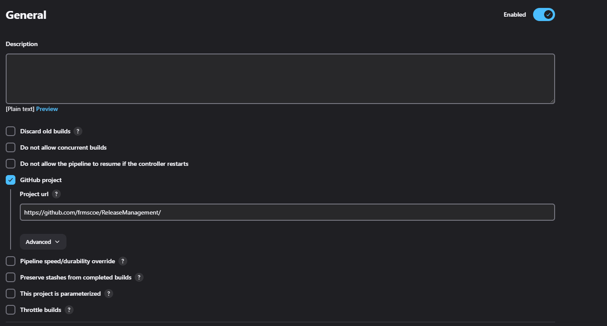
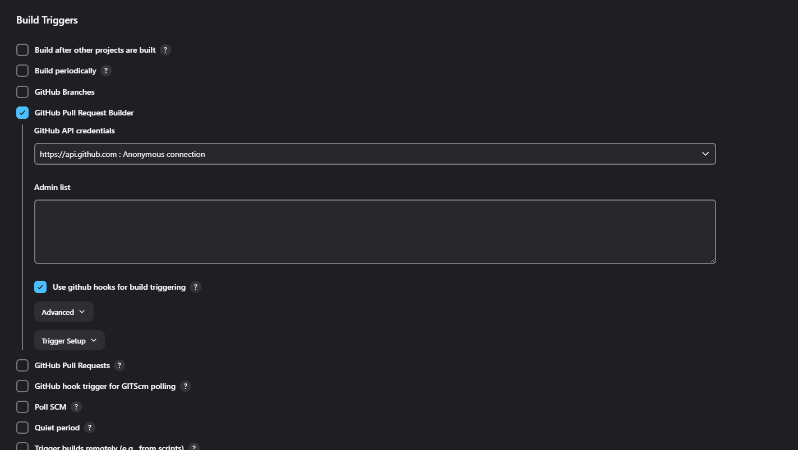
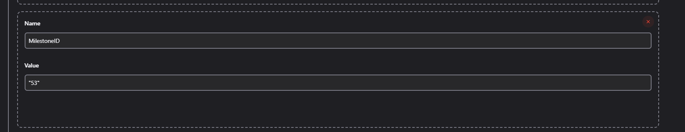
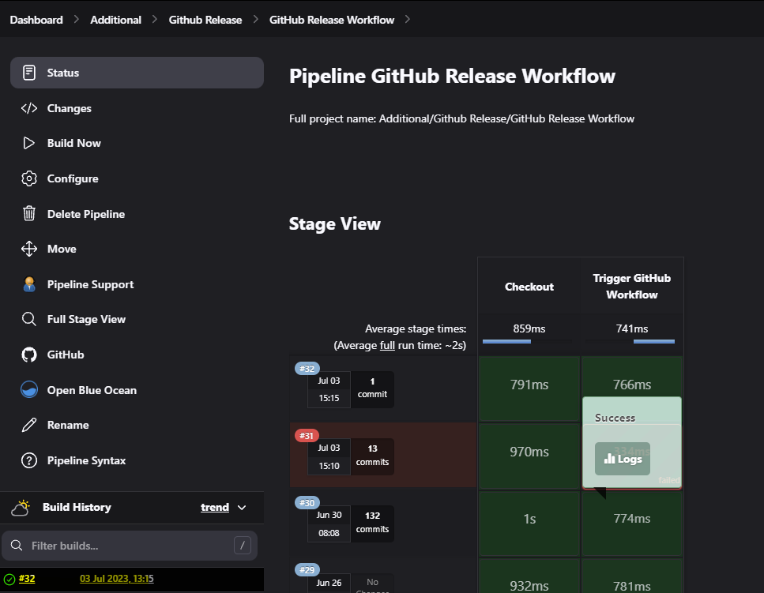
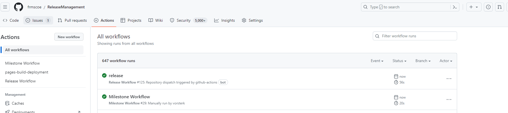
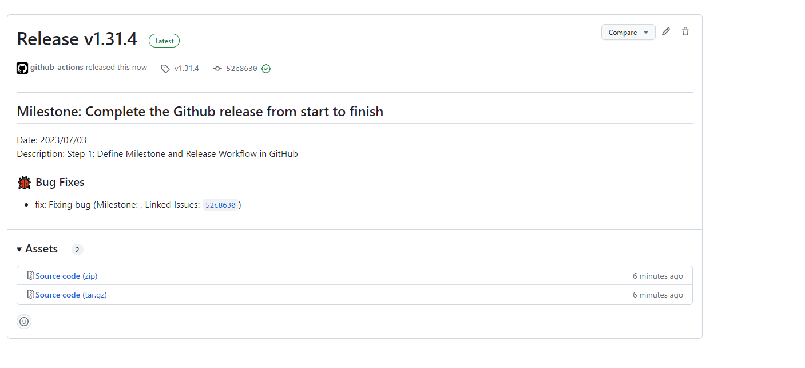

# Jenkins Release Builds

- [Jenkins Release Builds](#jenkins-release-builds)
  - [Setting Up a Jenkins Pipeline Job for Milestone Workflow on GitHub](#setting-up-a-jenkins-pipeline-job-for-milestone-workflow-on-github)
    - [Prerequisites](#prerequisites)
    - [Step 1: Create a Jenkins Pipeline Job](#step-1-create-a-jenkins-pipeline-job)
    - [Step 2: Configure the Pipeline Script](#step-2-configure-the-pipeline-script)
    - [Step 3: Configure GitHub Token](#step-3-configure-github-token)
    - [Step 4: Configure the GitHub Repository](#step-4-configure-the-github-repository)
    - [Step 5: Configure the Milestone ID](#step-5-configure-the-milestone-id)
    - [Step 6: Save and Run the Jenkins Job](#step-6-save-and-run-the-jenkins-job)

## Setting Up a Jenkins Pipeline Job for Milestone Workflow on GitHub

The following document provides a step-by-step guide to setting up a Jenkins pipeline job that triggers a milestone workflow on GitHub. The pipeline script will utilize a GitHub token for authentication purposes.

### Prerequisites

1. Jenkins server is installed and configured.
2. Jenkins plugins for Git and GitHub integration are installed.
3. A GitHub repository is available with the milestone workflow defined.

### Step 1: Create a Jenkins Pipeline Job

1. Log in to your Jenkins server.
2. Click on "New Item" to create a new Jenkins job.
3. Enter a suitable name for the job and select "Pipeline" as the job type.
4. Click on "OK" to proceed.
  
### Step 2: Configure the Pipeline Script

1. In the job configuration select the GitHub project check box

2. Scroll down and check the Github pull request builder

3. In the job configuration page, scroll down to the "Pipeline" section.
4. Select the "Pipeline script" option.
5. Copy and paste the following pipeline script into the script editor:

```
pipeline {
  agent any

  environment {
    GITHUB_TOKEN = credentials('Github Token')
  }

  stages {
    stage('Checkout') {
      steps {
        checkout([$class: 'GitSCM', branches: [[name: '*/main']], userRemoteConfigs: [[url: 'https://github.com/frmscoe/ReleaseManagement']]])
      }
    }

    stage('Trigger GitHub Workflow') {
      steps {
        script {
          def milestoneID = ${MilestoneID} // Replace with the actual milestone number or retrieve it dynamically
          def response = sh(script: "curl -X POST -u vorsterk:${env.GITHUB_TOKEN} https://api.github.com/repos/frmscoe/ReleaseManagement/actions/workflows/61476549/dispatches -d '{"ref":"main", "inputs": {"milestoneId":"${milestoneID}"}}'", returnStdout: true)
          echo response
        }
      }
    }
  }
}
```

### Step 3: Configure GitHub Token

1. In the pipeline script, locate the `environment` section.
2. Replace `'Github Token'` with the name of the Jenkins credential that holds your GitHub personal access token.

- To create a GitHub token, go to your GitHub account settings > Developer Settings > Personal Access Tokens, and generate a new token with appropriate permissions.
- In Jenkins, create a new credential of type "Secret Text" and paste the GitHub token in the "Secret" field. Provide an appropriate ID for the credential.
  
### Step 4: Configure the GitHub Repository

1. In the pipeline script, locate the `checkout` step under the "Checkout" stage.
2. Replace the URL `'https://github.com/frmscoe/ReleaseManagement'` with the URL of your GitHub repository.
  
- This URL should be in the format: `'https://github.com/<username>/<repository>'`.
  
### Step 5: Configure the Milestone ID

1. In the pipeline script, locate the line `def milestoneID = ${MilestoneID}` under the "Trigger GitHub Workflow" stage.
2. Replace `${MilestoneID}` with the actual milestone number you wish to trigger.
  
- You can either hardcode the milestone number or retrieve it dynamically using Jenkins parameters or other methods.



### Step 6: Save and Run the Jenkins Job

1. Click on "Save" to save the pipeline configuration.
2. Click on "Build Now" to run the Jenkins job and trigger the milestone workflow on GitHub.
3. Monitor the Jenkins job console output for any errors or issues.
  



