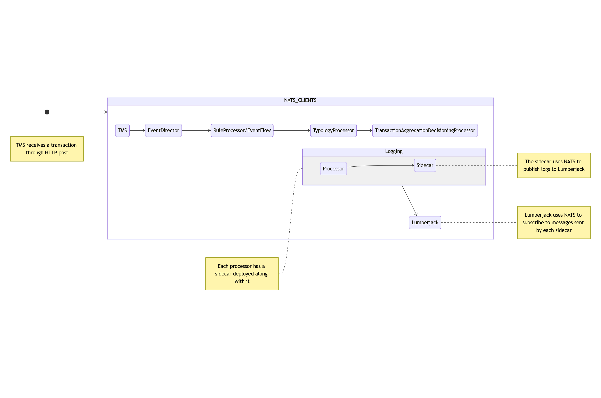
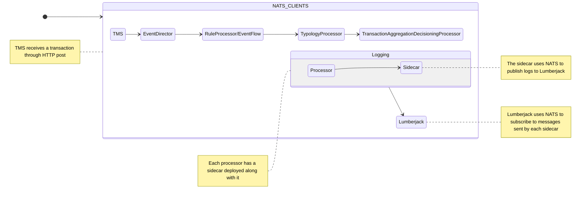

# NATS IPC Documentation for Tazama

This document serves to define how [NATS](https://nats.io) is used in Tazama

## 1. Overview

Tazama processors need to exchange data. NATS is an 
infrastructure that allows such data transmission, segmented in the form of 
messages<sup>[1](https://docs.nats.io/nats-concepts/what-is-nats)</sup>. Tazama processors transmit these messages to one another in the form of the pub-sub model: a processor publishes a message to a topic that another processor is subscribed to.

> NATS makes it easy for applications to communicate by sending and receiving messages. These messages are addressed and identified by subject strings, and do not depend on network location.
> 
> Data is encoded and framed as a message and sent by a publisher. The message is received, decoded, and processed by one or more subscribers.

NATS also provides a wide variety of libraries across different programming languages including a NodeJS library, which is leveraged by Tazama processors. Tazama processors then act as NATS clients which will connect to the NATS server process to carry out message transmission in the platform

## 2. Architecture Diagram

<details>
<summary>Mermaid source</summary>


</details>

From the diagram above, the transaction-monitoring-service (TMS) receives the transaction first from an external entity through HTTP.

From the diagram's directional flow, TMS has an outward arrow in the `NATS_CLIENTS` block but nothing feeding into it. This illustrates that TMS itself is only using NATS to publish messages (TMS is a NATS publisher):

> **In the context of the `NATS_CLIENTS` block***, TMS has one arrow going outward, so it only sends (or publishes) data. It has no data coming in, so it is not subscribing to any NATS subject

On the other hand, `EventDirector`, has an inward arrow (from TMS) as well as an ourward arrow (to `RuleProcessor`/`EventFlow`). This means that the `EventDirector` is both a publisher and a subscriber.

## 3. Messaging Configuration Model

The main variables used by NATS in the Tazama platform for core processors are:

- `SERVER_URL`: to denote the endpoint where the NATS server process is listening
  
- `PRODUCER_STREAM`: The subject that processor will forward messages to
  
- `CONSUMER_STREAM`: The subject that the processor will monitor for messages
  
- `INTERDICTION_PRODUCER`: A special variable that the typology-processor uses to publish events to
  

For the `event-sidecar` and `lumberjack` processors, it is just:

`NATS_SERVER`: to denote the endpoint where the NATS server process is listening

`NATS_SUBJECT`: The subject that the processor will forward/monitor for messages.

In the case of the `event-sidecar` specifically: the `event-sidecar` is a NATS publisher only (it receives data from the processors through gRPC), so the `NATS_SUBJECT` variable represents where to send messages. On the other end, `lumberjack` is a `NATS` subsciber only so the `NATS_SUBJECT` variable here is for representing the subject that this processor will use to check for messages (sent by the event-sidecar).

### Subjects and Naming Conventions

Tazama processors use the destination processor's name as the subject. The exception being rule and typology processors as versions has to be considered there.

| Subject | Publisher | Subscriber | Payload Format |
| --- | --- | --- | --- |
| `event-director` | transaction-monitoring-service | event-director | Protobuf |
| `sub-rule-[name]-[version]` | event-director | rule-processors | Protobuf |
| `pub-rule-[name]-[version]` | rule-processors | typology-processor | Protobuf |
| `typology-[cfg]` | typology-processor | transaction-aggregation-decisioning-processor | Protobuf |
| `[PRODUCER_STREAM]` | transaction-aggregation-decisioning-processor | N/A | Protobuf |

The transaction-aggregation-decisioning-processor will use the `SUPPRESS_ALERTS` variable to check whether it needs to publish the message after processing. If this variable evaluates to false, then the transaction-aggregation-decisioning-processor publishes the message to the subject specified by the processor's `PRODUCER_STREAM` environment variable

### Wireformat

Tazama uses protocol buffers to encode the message before transmission on the publisher's side. It is the subscriber's responsibility to decode this message (from the bytes) back to something that can be used by the developers in code.

### Pub/Sub Pattern

Tazama uses core NATS:

- The publisher sends a message to a subject
  
- Subscribers that a listening to that subject receive the message
  
- There is no message persistence or history so if processors are not subscribed when the message is sent, they will not receive it
  
- The publisher does not keep track of whether the message has been received or not so there are no delivery guarantees, no retry mechanisms and no acknowledgements
  

## Security

Tazama uses an insecure NATS: any client can connect to the server if it can reach the endpoint that the server is exposing.

NATS does have a wide variety of security options: [Security | NATS Docs](https://docs.nats.io/nats-concepts/security)

### Username and Password

Username and password authentication is one of the options that can be added to NATS.

#### Configuration

There are two options to enable username and password authentication. When starting the NATS server:

```shell
nats-server --user username --pass test
```

This will secure your NATS server so that clients connecting to it have to specify that username and password when they try to connect.

You can also specify a config file. The CLI parameters specified above would correspond to the following configuration passed to your NATS server:

```json5
authorization: {
    user: username,
    password: test
}
```

To specify multiple users:

```json5
authorization: {
    users: [
        {
            user: username,
            password: test
        },
        {
            user: foo,
            password: bar
        },
    ]
}
```

The above uses plaintext passwords, to protect your secrets, you would use a [Bcrypted](https://docs.nats.io/running-a-nats-service/configuration/securing_nats/auth_intro/username_password#bcrypted-passwords) password in place of your plaintext password

#### Implementation

Once enabled on the server, the [frms-coe-startup-lib](https://github.com/tazama-lf/frms-coe-startup-lib) which the NATS clients use should be updated to connect to NATS with the specified username and password.

The function to connect to NATS accepts a [ConnectionOptions | @nats-io/nats-core](https://nats-io.github.io/nats.js/core/interfaces/ConnectionOptions.html) interface. This contains the fields like `user` and `pass` as well as `servers` (which is the sole field we currently specify).

Current implementation (no auth):

```typescript
  const server = {
    servers: startupConfig.serverUrl, // config from ENV variables
  }; // an object of ConnectionOptions -> only servers specified

  let NatsConn = await connect(server);
```

Possible implementation (with auth):

```typescript
  const server = {
    servers: startupConfig.serverUrl, // config from ENV variables
    user: startupConfig.natsUsername,
    pass: startupConfig.natsPassword
  }; // an object of ConnectionOptions -> only servers specified

  let NatsConn = await connect(server);
```

The possible implementation will also require updates to the client/processor's environment. There is a NATS environment validator that exists in the [GitHub - tazama-lf/frms-coe-startup-lib: frms-coe-startup-lib](https://github.com/tazama-lf/frms-coe-startup-lib) where it lists the variables used in relation to NATS, checks whether their optional or not and asserts their validation. If Tazama wants authentication to be required (the NATS server is always deployed with auth) - the variables will be added here and set to be non-optional. The `IStartupConfig` interface will also be updated to reflect the new fields, `natsUsername` and `natsPassword`. When creating an IStartupConfig object, two fields should be added:

```typescript
export const startupConfig: IStartupConfig = {
    // omitted
    natsUsername: validateEnvVar<string>('NATS_USERNAME', 'string'),
    natsPassword: validateEnvVar<string>('NATS_PASSWORD', 'string'),
};
```

Where the configuration above will configure the processor to look for a `NATS_USERNAME` and `NATS_PASSWORD` environment variable and saves them to the corresponding fields in the `startupConfig` variable, which is a type of `IStartupConfig`: [frms-coe-startup-lib/src/interfaces/iStartupConfig.ts at 4cd952a948950f94d83692926a2ed6a997aac8fd · tazama-lf/frms-coe-startup-lib · GitHub](https://github.com/tazama-lf/frms-coe-startup-lib/blob/4cd952a948950f94d83692926a2ed6a997aac8fd/src/interfaces/iStartupConfig.ts#L72)

This `startupConfig` is what is used to connect to NATS by each processor utilising the frms-coe-startup-lib.

#### Lumberjack and Event-Sidecar

Take note that the event-sidecar and lumberjack do not depend on the frms-coe-startup-lib. In the standard Tazama deployment, they use the same NATS server as the rest of the processors. There are two options:

- If the NATS server is deployed with authentication required **AND** you still want the event-sidecar and lumberjack processors to utilise this NATS server, those processors will need to be updated to cater for this change or else they will not be able to connect to NATS - this could be a refactor to the event-sidecar and lumberjack process to use the `frms-coe-startup-lib`.
  
  - The `frms-coe-startup-lib` was not added to the `event-sidecar` and `lumberjack` processors because it also validates an additional set of variables as part of NATS, whereas the event-sidecar and lumberjack only require two variables - the NATS server URL and the subject to use for communication. So if this refactor take place, those processors will also validate variables they do not use.
    
- Deploy an insecure NATS instance and change the event-sidecar and lumberjack processors to use that as their NATS server instead. This will allow the core processor data transmission process to go through a secure NATS, but log events go through an insecure NATS
  

## Additional Information

For information on how the processors connect to NATS technically, consult the [GitHub - tazama-lf/frms-coe-startup-lib: frms-coe-startup-lib](https://github.com/tazama-lf/frms-coe-startup-lib/) documentation